# [Hands-on] Using Built-in Tools

Build four general-purpose agents that use Agent Mesh built-in tools, then have the orchestrator use them together.

---

## Step 1: Build the agents with Quick Build

1. In the Agent Mesh web UI, go to **Builder → Quick Build**

    <div align="center">
      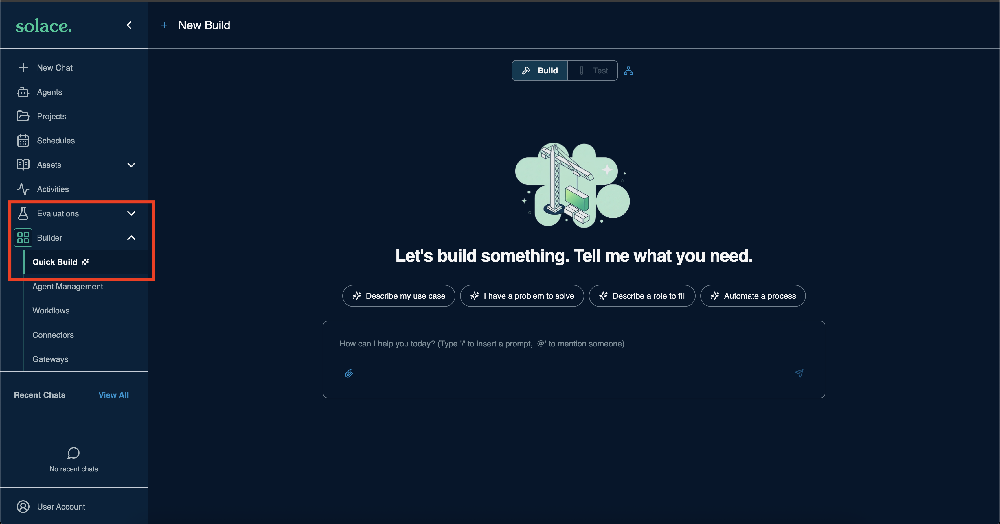
    </div>

1. Paste the following prompt and send it:

    ```
    Create the following agents that leverage the built in tools.
    Agents to create:

    1. Web Researcher
    Role: Web research specialist. Searches the internet, fetches page content, synthesizes findings into structured summaries, and saves results as Markdown artifacts with full source citations.
    Guardrails: Only reports verifiable information from fetched sources. Never fabricates citations. Declares uncertainty when sources conflict. Does not attempt to access authenticated or private URLs.

    2. Data analyst
    Role: Structured data analysis specialist. Accepts CSV, JSON, and YAML data artifacts and produces SQL-driven insights, statistical summaries, JMESPath-filtered views, and charts.
    Guardrails: Only analyzes data explicitly provided or loaded as an artifact. Never invents data points or fills gaps with assumptions. Always describes the dataset structure before drawing conclusions.

    3. Image Analyst
    Role: Visual intelligence specialist. Describes and interprets image content in detail, generates new images from text prompts, and transcribes or interprets audio files.

    4. Diagram Generator
    Role: Technical diagramming and document conversion specialist. Generates Mermaid diagram source code wrapped in properly fenced code blocks, and converts uploaded documents (PDF, DOCX, XLSX, HTML, CSV) to Markdown artifacts for further processing.
    Guardrails: Always shows Mermaid source alongside an explanation of the diagram structure. Uses descriptive node labels. Asks for clarification on diagram intent before generating. Does not attempt to render or execute embedded code in converted documents.
    Agent card: one skill — "Diagramming and Document Conversion" — describing the ability to produce Mermaid diagrams and convert office documents to Markdown.
    ```

1. Watch the activity timeline while Quick Build works

    <div align="center">
      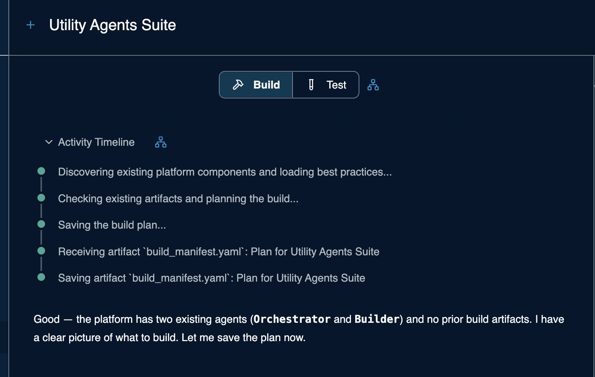
    </div>

1. Review the generated plan

    <div align="center">
      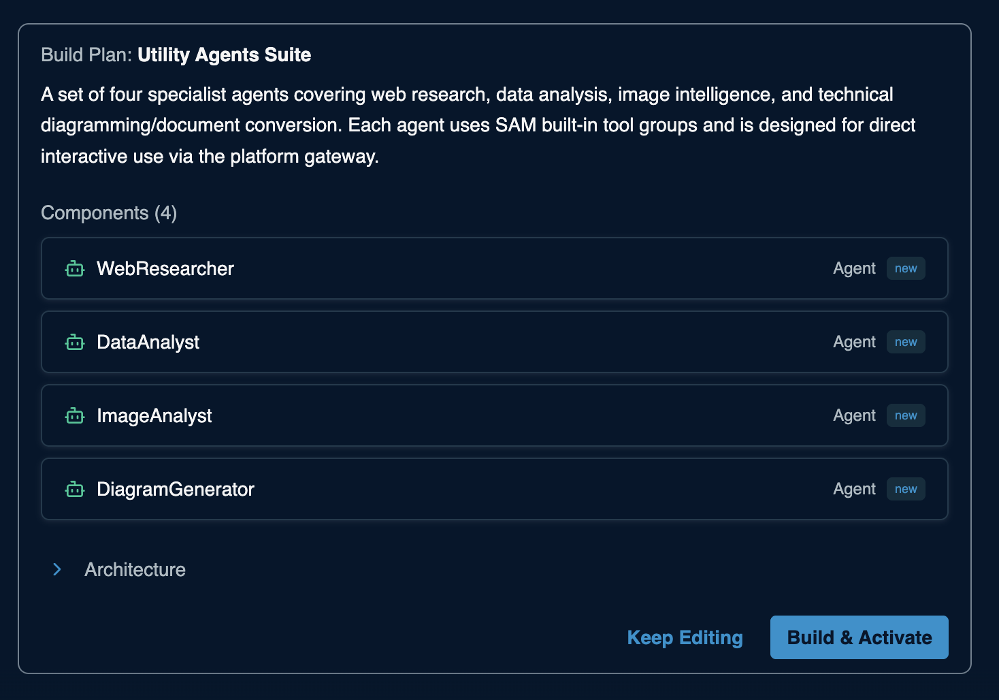
    </div>

1. Click `Build & Activate`

    <div align="center">
      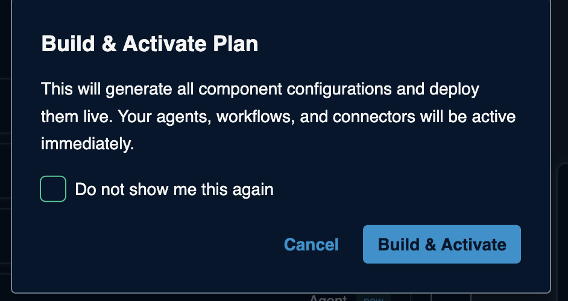
    </div>

1. Wait while the four agents are built in parallel

    <div align="center">
      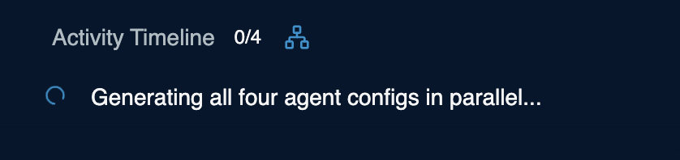
    </div>

    <div align="center">
      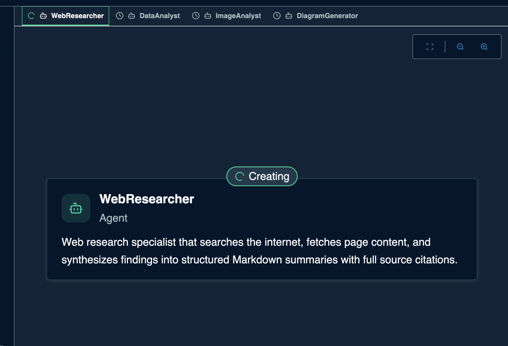
    </div>

1. The build is done when you see:

    > Finalising manifest and running full validation...

---

## Step 2: Interact with the agents

1. Open the **Agents** tab and confirm the four new agents are listed

    <div align="center">
      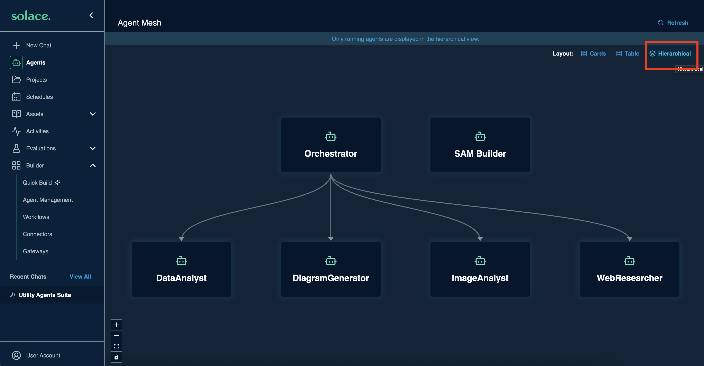
    </div>

    > Hint: Click the hierarchical view to see how the agents relate to the orchestrator.

1. Click `+ New Chat`

    <div align="center">
      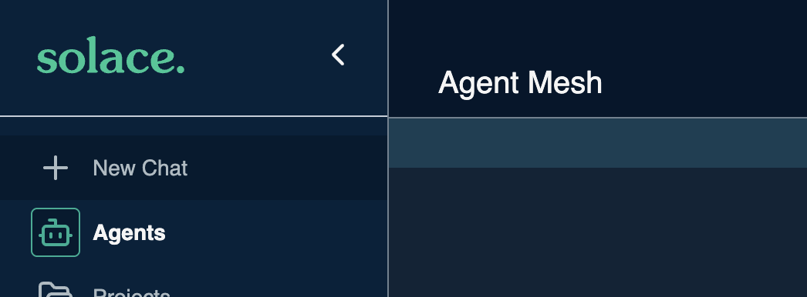
    </div>

1. Select the **Orchestrator** from the agent drop-down menu

    <div align="center">
      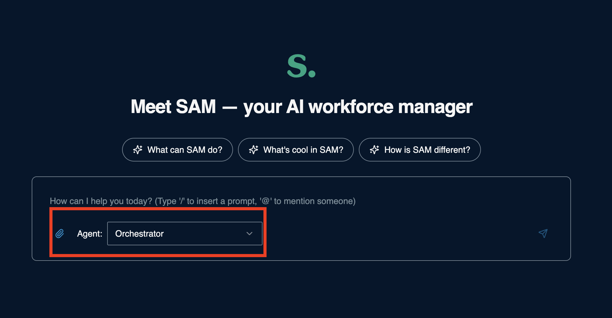
    </div>

1. Paste the following prompt and send it:

    ```
    Research the top 10 most valuable public companies in the world as of 2025, including their market capitalization, industry, and country of origin. Save the results as a structured dataset, then analyze it to find the total market cap by industry and by country, and finally create a Mermaid diagram that visualizes the breakdown.
    ```

1. Watch the activity timeline. The orchestrator delegates to the Web Researcher, Data Analyst, and Diagram Generator in turn.

    <div align="center">
      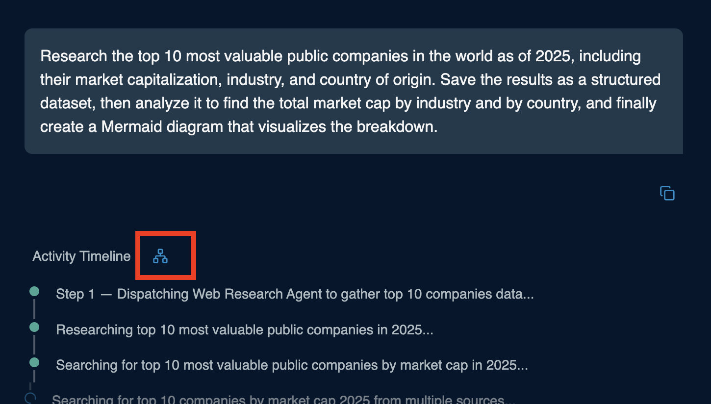
    </div>

1. Open the **Files** tab to see the generated artifacts

    <div align="center">
      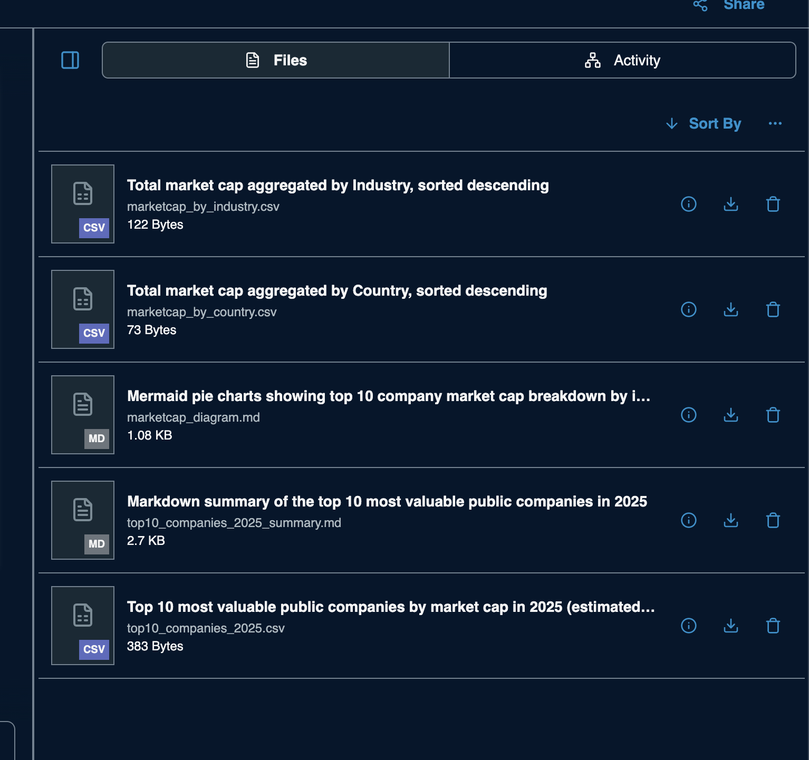
    </div>

---
Section complete! Close this file and return to the Workshop Tracker to continue.
