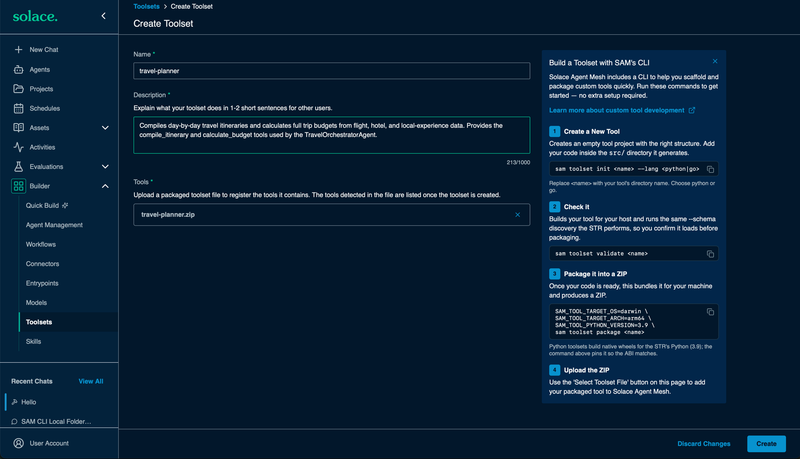
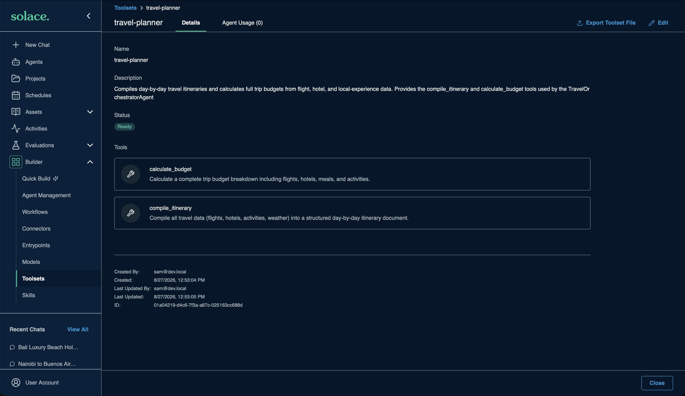

# [Hands-on] Using Custom Tools

Add the `travel-planner` custom toolset. It is written in Go and provides two tools that the TravelOrchestratorAgent uses later:

| Tool | What it does |
|---|---|
| `compile_itinerary` | Compiles flights, hotels, activities, and weather into a day-by-day itinerary |
| `calculate_budget` | Calculates a full trip budget: flights, hotels, meals, and activities |

Choose one option:

- [Option 1: Apply with the `sam` CLI (recommended)](#option-1-apply-with-the-sam-cli-recommended)
- [Option 2: Package and upload through the web UI](#option-2-package-and-upload-through-the-web-ui)

> [!NOTE]
> Both options compile the Go source on your machine. Go is pre-installed in the Codespace. On SAM Desktop, [install Go](https://go.dev/doc/install) first.

---

## The toolset source

The toolset lives in [sample_configuration/toolsets](../sample_configuration/toolsets/):

```
sample_configuration/toolsets/
├─ travel-planner.yaml        # toolset name and description
└─ travel-planner/
   └─ src/
      ├─ main.go              # the compile_itinerary and calculate_budget tools
      ├─ go.mod
      ├─ manifest.yaml        # tells the Secure Tool Runtime how to run the binary
      ├─ build.sh             # build script for macOS / Linux
      └─ build.bat            # build script for Windows
```

---

## Option 1: Apply with the `sam` CLI (recommended)

### Step 1: Review the manifest

Open [sample_configuration/manifests/07-custom-tools.yaml](../sample_configuration/manifests/07-custom-tools.yaml):

```yaml
kind: manifest
name: 07-custom-tools
description: Adds the travel-planner custom toolset
target:
  url: http://localhost:8800
resources:
  toolsets:
    - travel-planner
```

| Field | Meaning |
|---|---|
| `target.url` | The Agent Mesh instance to apply to |
| `resources.toolsets` | The toolsets to manage, by name. `travel-planner` matches `toolsets/travel-planner.yaml` |

### Step 2: Plan the change

From the root of the repository, run:

```bash
sam config plan --manifest sample_configuration/manifests/07-custom-tools.yaml
```

The CLI builds the toolset for your Agent Mesh instance, then shows `travel-planner` as a resource to create.

### Step 3: Apply the change

```bash
sam config apply --manifest sample_configuration/manifests/07-custom-tools.yaml
```

The CLI builds the toolset, packages it as a zip, uploads it, and waits until the tools are discovered.

> [!NOTE]
> On SAM Desktop, add `--target desktop` to both commands.

Continue to [Verify the toolset](#verify-the-toolset).

---

## Option 2: Package and upload through the web UI

### Step 1: Package the toolset

From the root of the repository, run:

```bash
sam toolset package travel-planner sample_configuration --url http://localhost:8800 -o travel-planner.zip
```

> [!NOTE]
> On SAM Desktop, replace `--url http://localhost:8800` with `--target desktop`.

This writes `travel-planner.zip`, which contains the compiled binary and `manifest.yaml`. The `--url` or `--target` flag makes sure the binary is built for the architecture your Agent Mesh instance runs on.

### Step 2: Upload the zip

1. In the Agent Mesh web UI, go to **Builder → Toolsets**
1. Click **+ Create Toolset**
1. Fill in the form:

    | Field | Value |
    |---|---|
    | Name | `travel-planner` |
    | Description | `Compiles day-by-day travel itineraries and calculates full trip budgets from flight, hotel, and local-experience data. Provides the compile_itinerary and calculate_budget tools used by the TravelOrchestratorAgent.` |
    | Tools | Click **Select Upload File** and choose `travel-planner.zip` |

    <div align="center">
      
    </div>

1. Click **Create**
1. In the **Add Toolset to Agent** dialog, click **Cancel**. You attach the toolset to an agent in a later step.

---

## Verify the toolset

1. In the Agent Mesh web UI, go to **Builder → Toolsets**
1. Confirm `travel-planner` shows the status **Ready**
1. Confirm it lists the tools `compile_itinerary` and `calculate_budget`

<div align="center">
  
</div>

> [!TIP]
> If the status stays at **Discovering** or shows `exec format error`, the binary was built for the wrong architecture. Repeat the step with the correct `--url` or `--target`.

---
Section complete! Close this file and return to the Workshop Tracker to continue.
