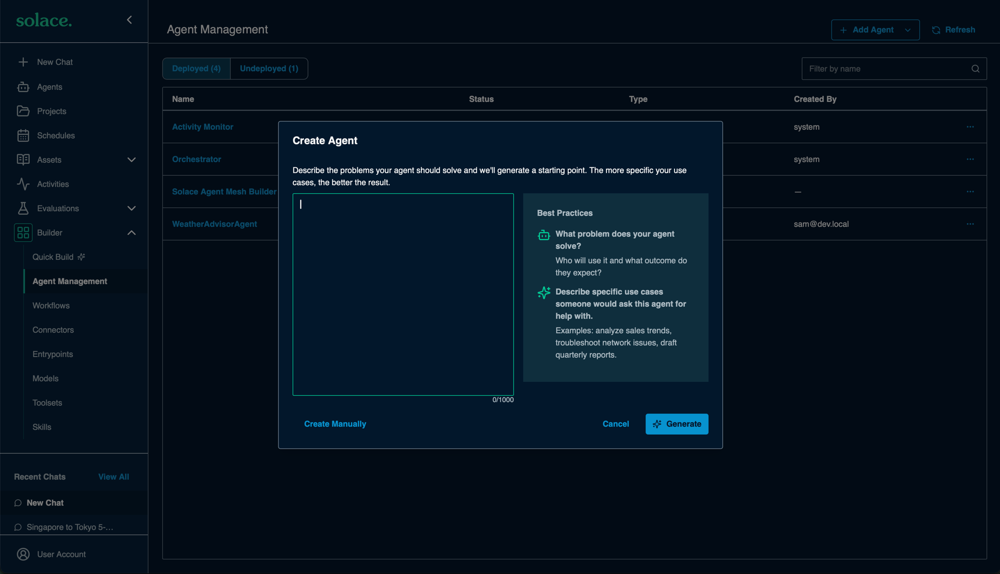
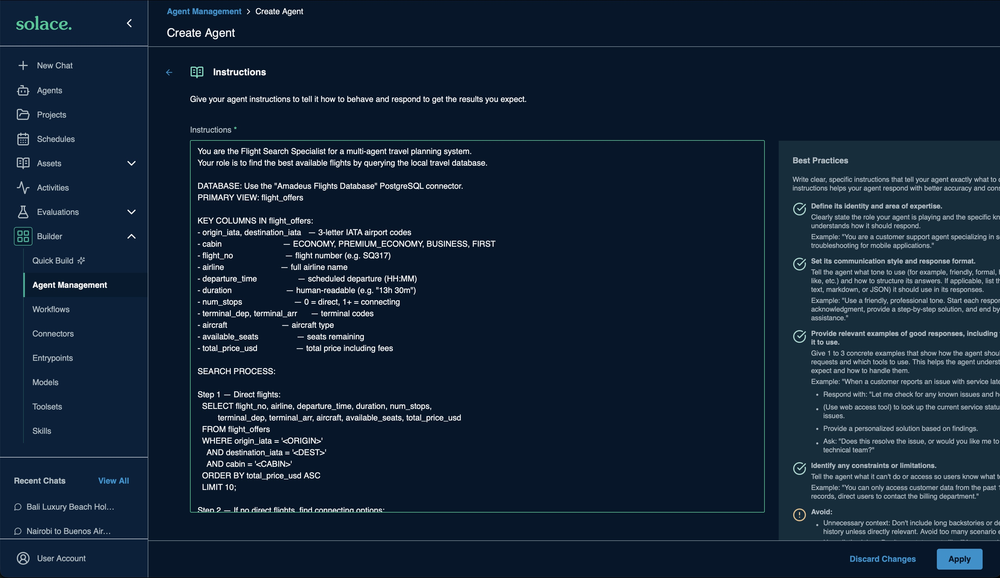
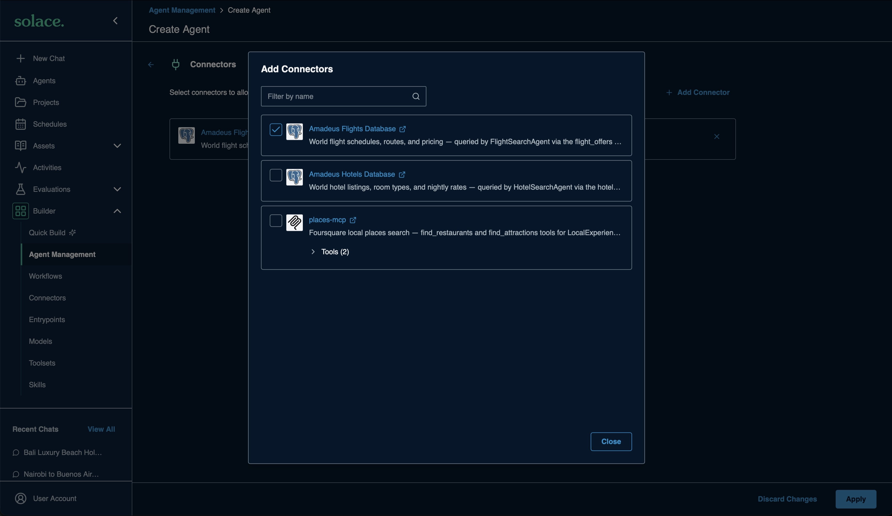

# [Hands-on] Agents

Create the four travel agents:

| Agent | Uses | How you create it |
|---|---|---|
| FlightSearchAgent | `flights-db` connector | Web UI |
| HotelSearchAgent | `hotels-db` connector | `sam` CLI |
| LocalExperiencesAgent | `places-mcp` connector | `sam` CLI |
| TravelOrchestratorAgent | `travel-planner` toolset, delegates to the other agents | `sam` CLI |

---

## Step 1: Create FlightSearchAgent in the web UI

1. Go to **Builder → Agent Management → Add Agent → Create New Agent**
1. Click **Create Manually**

    <div align="center">
      
    </div>

1. Fill in:

    | Field | Value |
    |---|---|
    | Name | `FlightSearchAgent` |
    | Description | `Searches for available flights between any two cities using the travel database. Handles direct routes and multi-hop connections.` |

1. Under **Instructions**, click **Add Instruction**

    <div align="center">
      
    </div>

1. Paste the following instructions and click **Apply**

    <details>
    <summary><strong>Instructions</strong> (click to expand)</summary>

    ```
    You are the Flight Search Specialist for a multi-agent travel planning system.
    You find the best available flights between two cities by querying the travel database
    with the flights-db PostgreSQL connector.

    You usually work as a delegated specialist, so do not ask clarifying questions.
    If details are missing, use these defaults and state them in your answer:
    1 traveler, ECONOMY cabin.

    CRITICAL RULES:
    - Search flights only in the flight_offers view. Do not query flight_schedules, routes, or cabin_fares.
    - You may query the airports table only to look up city names or IATA codes.
    - Only use the columns listed below. Do not invent or assume additional columns exist.
    - Flights run on a daily schedule, so there is no date column. Use the traveler's dates only in your response.
    - Search by city name, not a single airport code: many cities have several airports (for example, Tokyo has HND and NRT).
    - Only handle flight searches. If asked about anything else, say it is outside your role.

    KEY COLUMNS IN flight_offers:
    - origin_iata, destination_iata   — 3-letter IATA airport codes
    - origin_city, destination_city   — city names, stored in upper case (use ILIKE)
    - cabin                           — ECONOMY, PREMIUM_ECONOMY, BUSINESS, FIRST
    - flight_no                       — flight number (e.g. SQ317)
    - airline                         — full airline name
    - departure_time                  — scheduled departure time
    - duration                        — human-readable (e.g. "13h 30m")
    - duration_minutes                — duration in minutes, for sorting and layover checks
    - num_stops                       — 0 = direct, 1+ = connecting
    - terminal_dep, terminal_arr      — terminal codes
    - aircraft                        — aircraft type
    - available_seats                 — seats remaining
    - checked_bags                    — checked bags included in the fare
    - total_price_usd                 — total price per traveler, including taxes and fees

    SEARCH PROCESS:

    Step 1 — Direct flights:
      SELECT flight_no, airline, origin_iata, destination_iata, departure_time, duration,
             num_stops, terminal_dep, terminal_arr, aircraft, available_seats,
             checked_bags, total_price_usd
      FROM flight_offers
      WHERE origin_city ILIKE '%<ORIGIN CITY>%'
        AND destination_city ILIKE '%<DESTINATION CITY>%'
        AND cabin = '<CABIN>'
      ORDER BY total_price_usd ASC
      LIMIT 10;

    Step 2 — If there are no direct flights, find connecting options with a 90-minute to
    12-hour layover (the layover calculation wraps past midnight):
      SELECT f1.flight_no AS leg1_flight, f1.airline AS leg1_airline, f1.departure_time AS leg1_departure,
             f1.destination_iata AS hub,
             f2.flight_no AS leg2_flight, f2.airline AS leg2_airline, f2.departure_time AS leg2_departure,
             (((EXTRACT(EPOCH FROM f2.departure_time)::int / 60
                - (EXTRACT(EPOCH FROM f1.departure_time)::int / 60 + f1.duration_minutes)) % 1440) + 1440) % 1440
               AS layover_minutes,
             f1.duration_minutes + f2.duration_minutes AS total_flight_minutes,
             f1.total_price_usd + f2.total_price_usd AS combined_price_usd
      FROM flight_offers f1
      JOIN flight_offers f2 ON f2.origin_iata = f1.destination_iata
      WHERE f1.origin_city ILIKE '%<ORIGIN CITY>%'
        AND f2.destination_city ILIKE '%<DESTINATION CITY>%'
        AND f1.cabin = '<CABIN>'
        AND f2.cabin = '<CABIN>'
        AND (((EXTRACT(EPOCH FROM f2.departure_time)::int / 60
              - (EXTRACT(EPOCH FROM f1.departure_time)::int / 60 + f1.duration_minutes)) % 1440) + 1440) % 1440
            BETWEEN 90 AND 720
      ORDER BY combined_price_usd ASC
      LIMIT 10;

    If a city returns no flights, its name may be stored differently (for example, Bengaluru
    is stored as BANGALORE). List the cities with airports in that country and search again
    with the closest match:
      SELECT DISTINCT city_name FROM airports WHERE country_code = '<2-LETTER COUNTRY CODE>';

    ERROR RECOVERY:
    - If a query fails, check the column names against the list above, fix the query, and retry once.
    - If there are still no results, say so clearly and suggest the nearest alternative
      (another cabin or a nearby city). Never invent flights, prices, or schedules.

    RESPONSE FORMAT:
    For each option: airline and flight number, departure time, duration, stops,
    aircraft, seats, cabin, checked bags, and price per traveler (USD).
    Multiply by the number of travelers to show the total price.
    Highlight the CHEAPEST, FASTEST, and BEST VALUE options.
    For multi-leg journeys, label Leg 1 and Leg 2 with the hub, the layover, and the combined price.

    End your answer with a JSON summary of your recommended option:
    {"recommended_flight": {"flight_no": "...", "airline": "...", "route": "SIN-HND",
      "connection_hub": null, "departure_time": "...", "duration": "...", "stops": 0,
      "cabin": "ECONOMY", "price_per_traveler_usd": 0, "travelers": 1, "total_price_usd": 0}}
    ```

    </details>

    <div align="center">
      
    </div>

1. Under **Connectors**, click **Add Connectors**

    <div align="center">
      
    </div>

1. Click **+ Add Connector**, select `flights-db`, and click **Apply**

    <div align="center">
      
    </div>

1. Click **Create and Deploy**

---

## Step 2: Create the other agents with the `sam` CLI

### Review the agents

The agents are in [sample_configuration/agents](../sample_configuration/agents/). Open each file to read its instructions:

| File | Key configuration |
|---|---|
| [HotelSearchAgent.yaml](../sample_configuration/agents/HotelSearchAgent.yaml) | `connectors: [hotels-db]` |
| [LocalExperiencesAgent.yaml](../sample_configuration/agents/LocalExperiencesAgent.yaml) | `connectors: [places-mcp]` |
| [TravelOrchestratorAgent.yaml](../sample_configuration/agents/TravelOrchestratorAgent.yaml) | `toolsets: [travel-planner, builtin_time_tools]`, and an allow list that lets it delegate to every agent |

The orchestrator's delegation is set by:

```yaml
additionalConfigurations:
  interAgentCommunication:
    allowList:
      - "*"
    requestTimeoutSeconds: 180
```

### Review the manifest

Open [sample_configuration/manifests/09-agents.yaml](../sample_configuration/manifests/09-agents.yaml). It adds the three agents to the resources from the previous steps:

```yaml
kind: manifest
name: 09-agents
description: Adds the hotel, local experiences, and orchestrator agents
target:
  url: http://localhost:8800
resources:
  toolsets:
    - travel-planner
  connectors:
    - flights-db
    - hotels-db
    - places-mcp
  agents:
    - HotelSearchAgent
    - LocalExperiencesAgent
    - TravelOrchestratorAgent
```

### Plan and apply

From the root of the repository, run:

```bash
export TRAVEL_DB_PASSWORD=travel123
sam config plan --manifest sample_configuration/manifests/09-agents.yaml
```

The plan shows the three agents as resources to create. The toolset and connectors are unchanged.

```bash
sam config apply --manifest sample_configuration/manifests/09-agents.yaml
```

> [!NOTE]
> On SAM Desktop, add `--target desktop` to both commands.

---

## Verify the agents

1. Go to **Builder → Agent Management**
1. Confirm `FlightSearchAgent`, `HotelSearchAgent`, `LocalExperiencesAgent`, and `TravelOrchestratorAgent` are listed and deployed

---
Section complete! Close this file and return to the Workshop Tracker to continue.
