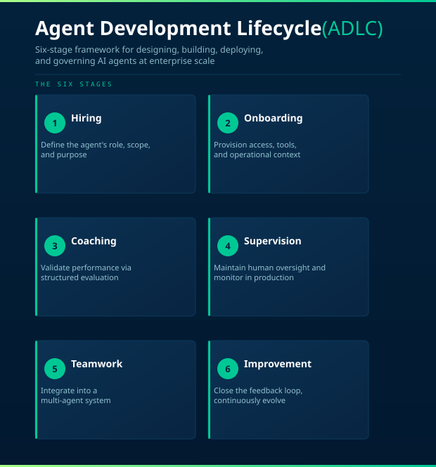
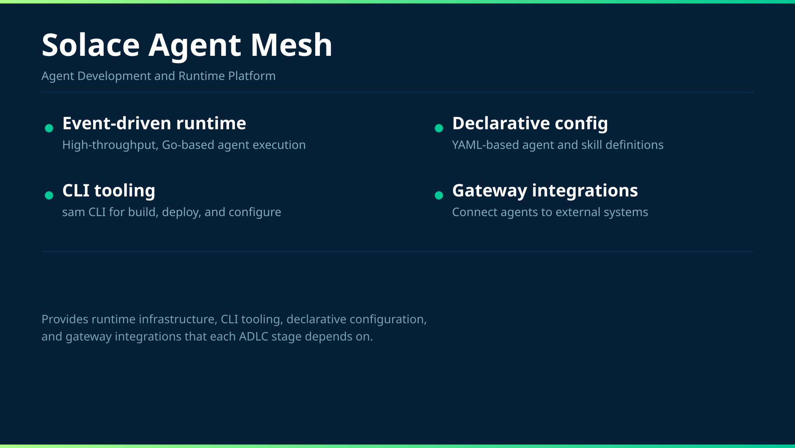
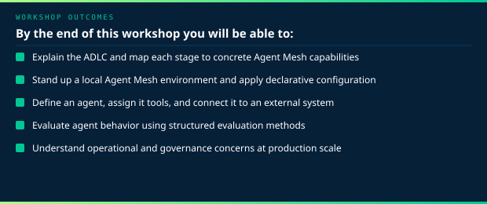
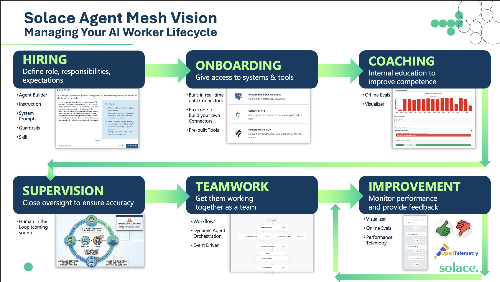

# Getting Started with Solace Agent Mesh

Welcome to the Solace Agent Mesh workshop. This guide is the entry point for the full hands-on experience. By the end of this workshop, you will have a working Agent Mesh environment, a conceptual understanding of the Agent Development Lifecycle (ADLC), and the foundational skills to build, deploy, and operate AI agents in an enterprise setting.

This workshop is designed for developers, architects, and technical practitioners who want to understand agent development as a structured engineering discipline, not just a collection of prompts and API calls.

---

## Table of Contents

- [What This Workshop Covers](#what-this-workshop-covers)
- [Understanding the ADLC](#understanding-the-adlc)
- [Prompts](#prompts)

---

## What This Workshop Covers

This workshop guides you through the Agent Development Lifecycle (ADLC): a six-stage framework for designing, building, deploying, and governing AI agents at enterprise scale using Solace Agent Mesh.

The ADLC is the methodology that underpins everything in this workshop. It defines the repeatable process that engineering teams need to move agents from initial concept to production-grade deployment. Each section of this workshop maps directly to a stage of the ADLC, giving you hands-on experience with the tooling, patterns, and decisions that each stage requires.

Alongside the ADLC methodology, you will work with Solace Agent Mesh directly. Agent Mesh is a Go-based, event-driven agent runtime built for enterprise scale. It provides the runtime infrastructure, CLI tooling, declarative configuration model, and gateway integrations that the ADLC stages depend on.

---

## Understanding the ADLC

The Agent Development Lifecycle (ADLC) is the framework this workshop is built around. It provides a structured, repeatable path from agent conception to continuous improvement in production.

The ADLC exists because agents are fundamentally different from traditional software. They are non-deterministic: the same input does not guarantee the same output. Standard software development methodologies, built for deterministic, rule-based systems, are not sufficient. A new lifecycle is required.

The six stages of the ADLC are:

| Stage | Name | What It Addresses |
|---|---|---|
| 1 | Hiring | Define what the agent does, who it serves, and what role it plays |
| 2 | Onboarding | Give the agent the right access, tools, and context it needs to operate |
| 3 | Coaching | Validate that the agent performs correctly through structured evaluation |
| 4 | Supervision | Maintain human oversight and monitor agent behavior in production |
| 5 | Teamwork | Integrate the agent into a multi-agent system |
| 6 | Improvement | Close the feedback loop and continuously improve agent performance |

Each stage of the ADLC maps directly to a set of Agent Mesh features. The workshop guides that follow this document each cover one stage in depth.

## Why do we need an ADLC

Good engineering requires a repeatable process. Agents introduce a new class of software that existing lifecycles do not cover.

The software industry has adapted its methodology each time a new paradigm required it:

- **SDLC** (early 1980s) — structured the process for deterministic, rule-based software
- **API Development Lifecycle** (Mulesoft, ~2013) — addressed the unique challenges of building integration-first software
- **ADLC** (2025/2026) — addresses AI agents, which are fundamentally non-deterministic

Agents behave differently from traditional software. The same input can produce different outputs. Testing a boolean condition is not sufficient. An agent can pass all unit tests and still give a user a wrong answer in production. A new methodology is required to handle this.

The ADLC gives development teams a structured, repeatable, quality-based way to build and operate agents at enterprise scale.

---

## Lets launch Solace Agent Mesh

- Click the Ports tab
- Click the browser icon next to the Solace Agent Mesh port

## Resources

- [Solace Agent Mesh Githiub Repository](https://github.com/solacelabs/solace-agent-mesh)
- [Solace Agent Mesh Docs](https://solacelabs.github.io/solace-agent-mesh/docs/documentation/getting-started/introduction/)
- [Solace Agent Mesh Core Plugins](https://github.com/SolaceLabs/solace-agent-mesh-core-plugins)
- [Solace Agent Mesh Community Plugins](https://github.com/solacecommunity/solace-agent-mesh-plugins/)

---
Section complete! Close this file and return to the Workshop Tracker to continue.