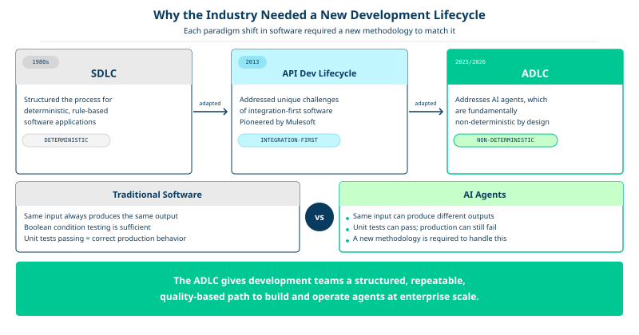
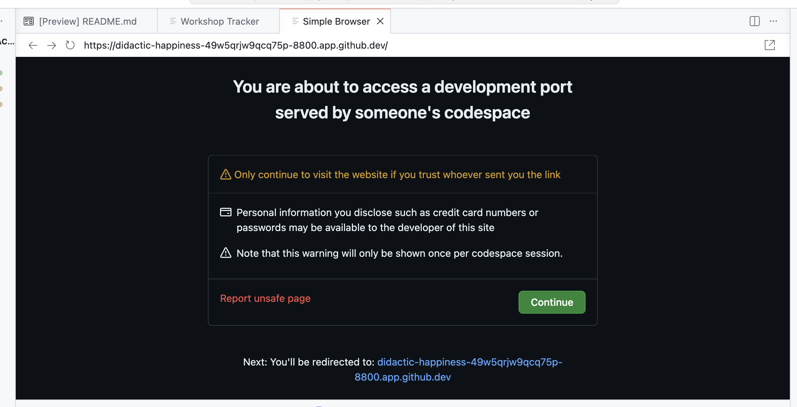
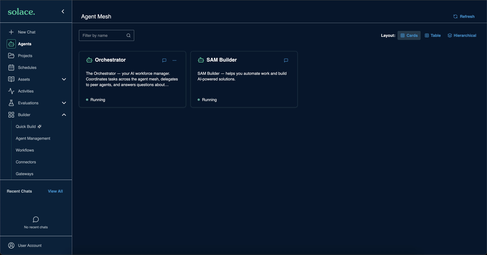

# Start Here: The Parts Bin

You have just watched one order that could not ship move through a system nobody touched. An event landed, a workflow woke up, inventory and the catalog were read, substitutes were scored, a message was drafted, a credit went to a human, and the outcome went back onto the mesh.

Over the next hundred minutes you will build every part of that.

This section is the only one without a keyboard exercise. It covers why building agents is a discipline, and what Solace Agent Mesh is actually made of.

---

## Table of Contents

- [Meridian Outfitters](#meridian-outfitters)
- [Why agents need their own lifecycle](#why-agents-need-their-own-lifecycle)
- [The parts bin](#the-parts-bin)
- [The three things called "skill"](#the-three-things-called-skill)
- [What you are building](#what-you-are-building)
- [Launch Solace Agent Mesh](#launch-solace-agent-mesh)
- [Resources](#resources)

---

## Meridian Outfitters

Meridian Outfitters is a national outdoor apparel retailer. 600 stores, an ecommerce site, a marketplace channel.

It is early November. Peak is three weeks out. The fulfillment exception queue is already 3,000 deep, worked by hand by twelve people in a shared inbox. At peak that volume goes up 40x. The team is underwater and hiring twelve more people is not the answer.

The workshop follows **one order that cannot be fulfilled**. A customer bought a jacket in medium. The warehouse is short. Everything you build from here handles that one order, and the pattern generalizes to the other 2,999.

---

## Why agents need their own lifecycle

Traditional software is deterministic. The same input produces the same output, so you can test it exhaustively and ship it with confidence.

Agents are not. The same prompt can produce different results on two consecutive runs. That single property breaks most of the assumptions a software development lifecycle is built on, which is why the industry has converged on a separate one.

- **SDLC** (early 1980s) structured the process for deterministic, rule-based software
- **API Development Lifecycle** (~2013) addressed integration-first software
- **ADLC** addresses AI agents, which are fundamentally non-deterministic

The Agent Development Lifecycle names six stages: hiring, onboarding, coaching, supervision, teamwork, and improvement.

<div align="center">
  
</div>

That is the last you will hear of it in this workshop.

The ADLC is a useful answer to "why is this a discipline and not a weekend project," and it earns these few paragraphs on that basis. It is deliberately **not** the table of contents for what follows. Sections are not labeled with stages, and nothing here is described as hiring or coaching an agent. The order you build in is dependency order: make the parts, assemble them, then wake the whole thing up.

---

## The parts bin

Solace Agent Mesh is a Go-based agent development and runtime platform. The useful way to think about it is a parts bin rather than a framework with one correct shape.

There are six kinds of part, and you will use all of them:

- **Connector**: a named, credentialed binding to an external system. Define it once, assign it to any number of agents by name. At runtime it appears to the agent as a tool. No code.
- **Agent**: a system prompt, an advertised set of capabilities, and references to the connectors, toolsets, and skills it may use. The part that reasons.
- **Toolset**: custom Go or Python code that runs in a sandbox. The part that must be exactly right every time.
- **Skill**: a packaged bundle of instructions and assets that any agent can load. The part that encodes policy owned by someone other than the agent's author.
- **Workflow**: a declared graph of steps. The part that decides what happens in what order, when you already know the order.
- **Entrypoint**: how work reaches the mesh from outside. Chat, Slack, email, MCP, or an event on a topic.

Underneath them sit three runtime processes and a broker.

<div align="center">
  
</div>

| Process | Role | Scales with |
|---|---|---|
| Agent-Workflow Executor | Runs agents and workflows | Number of concurrent tasks |
| Entrypoint Executor | Accepts work from outside the mesh | Inbound request volume |
| Secure Tool Runtime | Runs toolset and skill code in a sandbox | Tool invocation volume |

They communicate over a Solace event broker rather than direct HTTP calls between services. That choice is the reason the last section of this workshop is possible at all, and it is worth understanding before you get there.

<div align="center">
  
</div>

With HTTP, every service that wants to talk to another needs to know its address, its health, and its retry semantics. Adding a consumer means changing a producer. With a broker, a producer publishes to a topic and is finished. A new consumer subscribes and nobody redeploys anything.

Hold onto that. You will use it in the last fifteen minutes to add a capability without touching a single thing you built.

---

## The three things called "skill"

This trips people up, so it is worth thirty seconds now rather than twenty minutes of confusion later. Three different things in this workshop carry the name.

| Term | Where you see it | What it is |
|---|---|---|
| `kind: skill` | `sample_configuration/skills/` | A packaged, installable bundle of instructions and assets. A real platform resource. You build one in section 400. |
| `spec.skills` | inside an agent's YAML | The **agent card**. Descriptors advertising what the agent can do, so other agents can discover and delegate to it. Not a resource. |
| `.claude/skills/` | the repo root | Authoring aids for Claude Code and `sam ai-assistance`. Reference documentation, nothing to do with the running platform. |

When this workshop says "skill" without qualification, it means the first one.

---

## What you are building

Six sections, each adding one part, assembled around the single order that could not ship.

| Section | What you add | Why it exists |
|---|---|---|
| 200 | Two connectors | An agent that cannot reach a system cannot answer anything |
| 300 | Two agents | Something has to own the problem and reason about it |
| 400 | A toolset and a skill | Some decisions must not be guessed, and some policy is not yours to own |
| 500 | A workflow | The steps are known ahead of time, so declare them |
| 600 | An event mesh entrypoint | Nobody should have to click anything |

Every section from 200 onward ends the same way: edit a manifest, run `sam config plan` to see exactly what will change, then `sam config apply`. You will read a plan diff six times. That repetition is deliberate, and it teaches the platform's resource model faster than writing YAML from scratch would.

---

## Launch Solace Agent Mesh

Your Codespace has already started Solace Agent Mesh, a Solace event broker, and a seeded Meridian database.

1. Open the Simple Browser tab that appeared when the Codespace finished starting. If it is not open, check the **Ports** panel and open port `8800` in the browser.

    <div align="center">
        
    </div>

1. You should see the Solace Agent Mesh client with its built-in agents already registered.

    <div align="center">
        
    </div>

1. Confirm the database is seeded. Open a terminal and run:

    ```
    psql -h localhost -U postgres -d retail -c "SELECT order_id, status FROM orders WHERE order_id = 'ORD-10428';"
    ```

    > Note: You should see one row, `ORD-10428`, with status `exception`. That is the order this workshop follows. If the query returns nothing, tell the facilitator before continuing.

---

## Resources

- [Solace Agent Mesh documentation](https://solacelabs.github.io/solace-agent-mesh/)
- [Solace Agent Mesh on GitHub](https://github.com/SolaceLabs/solace-agent-mesh)
- [Solace Community](https://solace.community/)

---
Section complete! Close this file and return to the Workshop Tracker to continue.
