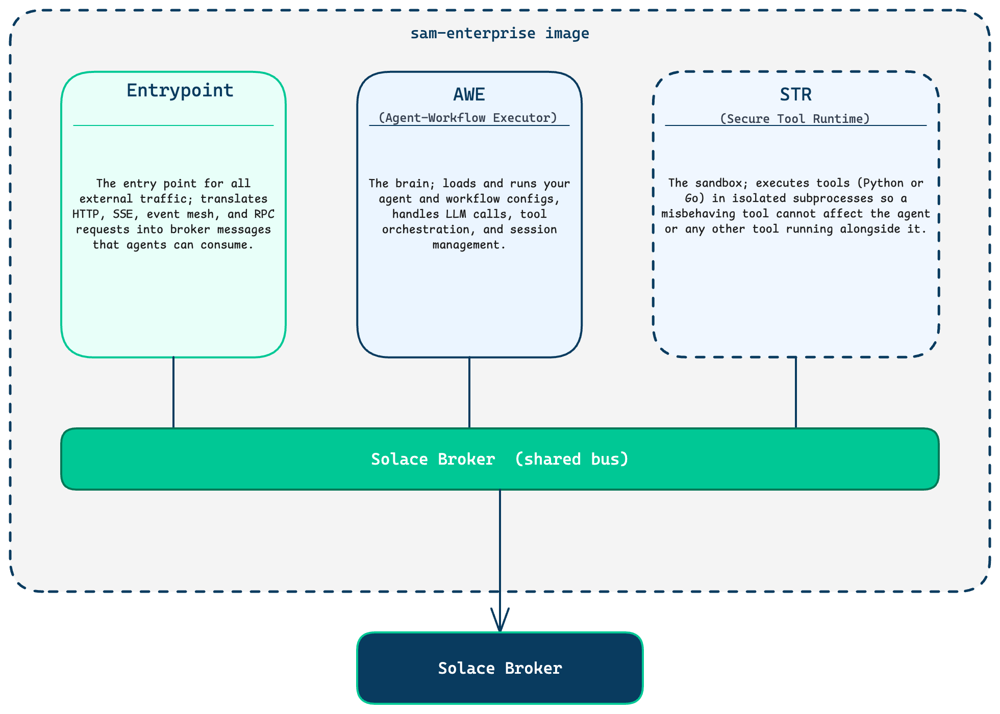
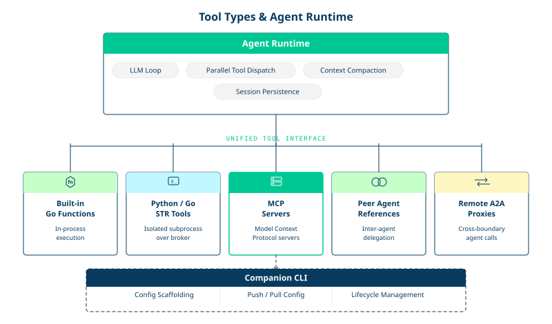
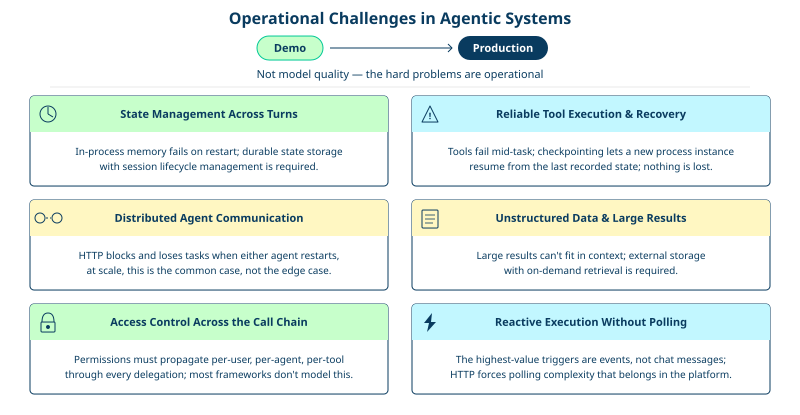
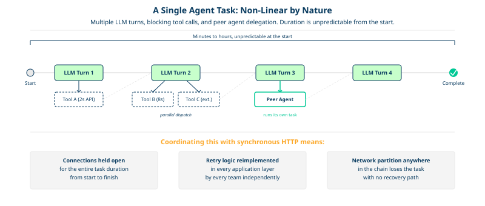
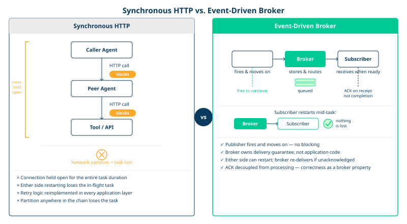
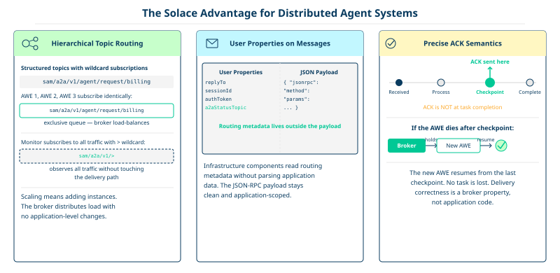
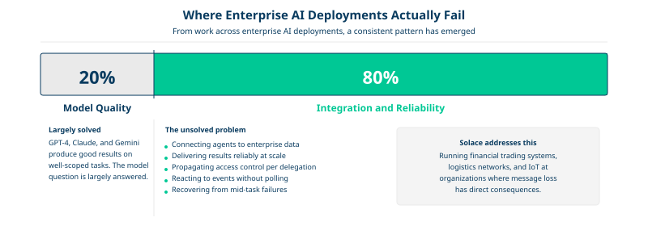

# What is Solace Agent Mesh

## Table of Contents

- [What is Solace Agent Mesh](#what-is-solace-agent-mesh)
- [General Challenges with Agentic Systems](#general-challenges-with-agentic-systems)
- [Why Event-Driven Agents on a Proven Message Broker](#why-event-driven-agents-on-a-proven-message-broker)
  - [The Solace Advantage](#the-solace-advantage)
  - [The integration gap is the real problem](#the-integration-gap-is-the-real-problem)
  - [Additive to existing event-driven investments](#additive-to-existing-event-driven-investments)

---

## What is Solace Agent Mesh

Solace Agent Mesh is a Go-based, event-driven agent runtime for building, deploying, and operating AI agents at enterprise scale. It provides the runtime infrastructure, declarative configuration model, and entrypoint integrations to run agents as always-on workers embedded in your event-driven architecture, not just as conversational endpoints you call on demand.

  

The platform is decomposed into three independently deployable process types:

| Process | Role | Scales with |
|---------|------|-------------|
| Agent-Workflow Executor (AWE) | Hosts agents, workflows, and proxy adapters | LLM workload (memory, compute) |
| Gateway Executor (GWE) | HTTP/SSE bridge from external clients to the agent mesh | Inbound connection count |
| Secure Tool Runtime (STR) | Isolated subprocess execution for tools | Tool invocation throughput |

All three processes communicate through a Solace message broker. No component calls another directly over HTTP or gRPC. The broker is the coordination fabric enabling horizontal scaling, failure isolation, and event-driven agents made possible without application-level coordination code.

  

Tools come in the following forms:

1. Built-in Go functions (in-process)
1. Python or Go STR tools (isolated subprocess over broker)
1. MCP servers
1. Peer agent references
1. Remote A2A proxies

Every tool type presents the same interface to the calling agent. The agent core handles the full LLM loop, parallel tool dispatch, context compaction, and session persistence.

A companion CLI handles config scaffolding, declarative config push/pull to a running WebUI Entrypoint, and lifecycle management across Go and Python agent runtimes running side by side on the same broker.

---

## General Challenges with Agentic Systems

The hard problems in agentic systems are no longer based in model quality. GPT-4+, Claude, and Gemini all produce good results on well-scoped tasks. The hard problems are operational, appearing the moment you move from a demo to a production deployment.

  

    
More details on Challenges

    ## State management across turns and restarts

    A useful agent maintains context across many turns, potentially across hours or days. Storing conversation history in process memory works until the process restarts. Storing it in a database requires solving concurrent modification, session lifecycle, and context window management as history grows. Most frameworks give you a list and leave the rest to you.

    ## Reliable tool execution and recovery

    Tools fail. External APIs time out, subprocesses crash, and network partitions happen mid-call. An agent that loses its place after a tool failure is not production software. You need checkpointing: a way to record execution state durably so a different process instance can resume where a dead one left off. Without it, every pod restart is a potential task loss.

    ## Distributed agent communication

    When an agent delegates to another agent, something has to route the request, deliver the response, and handle the case where either agent crashes mid-task. Point-to-point HTTP is fragile: the calling agent blocks waiting for a response, and if either side restarts, the task is lost. This is the common case at scale, not the edge case.

    ## Unstructured data and large tool results

    Tool results can be large. Embedding a full PDF, a database query result, or a large CSV in the LLM conversation context is expensive and often impossible within context window limits. You need an artifact pipeline: external storage for large results, references in the conversation, and on-demand content retrieval when the LLM needs specific data.

    ## Access control across the agent call chain

    Enterprise deployments cannot have every agent calling every tool with full permissions. You need per-user, per-agent, per-tool access control that propagates correctly when Agent A delegates to Agent B, which calls Tool C on behalf of User D. Most frameworks have no model for this at all. They assume a single trust boundary and stop there.

    ## Reactive execution without polling

    The highest-value agent use cases are not triggered by human chat messages. They are triggered by events: a new order arrives, a sensor threshold is crossed, a batch job completes, a file lands in an S3 bucket. Building this on top of an HTTP request/response model means building a polling layer, webhook infrastructure, or custom scheduling code that the application now has to maintain. That complexity belongs in the platform, not in application code.

---

## Why Event-Driven Agents on a Proven Message Broker

The argument for a dedicated message broker rather than HTTP, WebSockets, or a generic queue comes down to what you are actually asking the infrastructure to do.

Agents are not stateless services. A single agent task can span multiple LLM turns, multiple tool calls (some of which block for seconds waiting on external APIs), and multiple delegations to peer agents. The execution is non-linear and its duration is unpredictable. Coordinating this via synchronous HTTP means holding connections open for minutes, implementing retry logic at every layer, and accepting that a network partition anywhere in the chain can lose the task.

  

A message broker solves this structurally. The publishing component sends a message and moves on. The subscribing component receives it when ready. Acknowledgment is decoupled from processing time. Delivery guarantees are a broker property, not application code that every team reimplements differently.

### The Solace Advantage

Solace adds capabilities that matter specifically for distributed agent systems.

    
 Break down the Solace Advantage

    
    ## Hierarchical topic routing with wildcards.

     Solace topics are structured (`a/b/c`) and support `*` (single level) and `>` (trailing wildcard) subscriptions. Multiple AWE instances subscribe to `{namespace}/a2a/v1/agent/request/myagent` with exclusive queue semantics for load balancing, while a monitoring system subscribes to `{namespace}/a2a/v1/>` to observe all traffic without touching the delivery path. Scaling a component means adding instances and letting the broker distribute load.
    
    ## User properties on messages.

     Solace messages carry key-value metadata outside the JSON payload. Solace Agent Mesh uses this for routing: `replyTo`, `a2aStatusTopic`, `authToken`, `sessionId`. Infrastructure components can inspect routing metadata without parsing application data, and the JSON-RPC payload stays clean.

    ## Guaranteed delivery with precise acknowledgment semantics.
    
     The checkpoint system's correctness depends on ACK timing. An AWE acknowledges a request message at the moment it persists a checkpoint to the database, not at task completion. This is only possible because the broker tracks acknowledgment separately from delivery. Another AWE instance can resume the task from the checkpoint without the broker re-delivering the original message.

### The integration gap is the real problem

Through work across enterprise AI deployments, a consistent pattern has emerged: roughly 20% of challenges relate to the AI model itself, while 80% involve connecting agents to enterprise data and systems reliably. The model question is largely solved by other tools. The integration and reliability question is not.

Solace is not a hobbyist project or a cloud-native experiment. It runs in financial trading systems, logistics networks, and industrial IoT infrastructure at organizations where message loss has direct financial or safety consequences. The operational maturity, tuning tooling, and support infrastructure that come with that deployment history matter when you are running agents that coordinate actual business processes.

### Supplementary to existing event-driven investments

For enterprises already running Solace for event streaming across microservices, IoT, or financial data pipelines, Solace Agent Mesh is additive. Agents join the existing event mesh as first-class participants. They can subscribe to topics already carrying business events and react to them in real time. The broker investment pays dividends across both the existing architecture and the new agent layer, without any forklift migration.

---

Event-driven agents on a proven message broker is the right primitive for the coordination problem agents actually have: non-linear, long-duration, distributed task execution where any participant can fail at any point and the system must recover without losing work. Message brokers are designed precisely for that problem. Solace has been solving it in production for two decades.

---
Section complete! Close this file and return to the Workshop Tracker to continue.