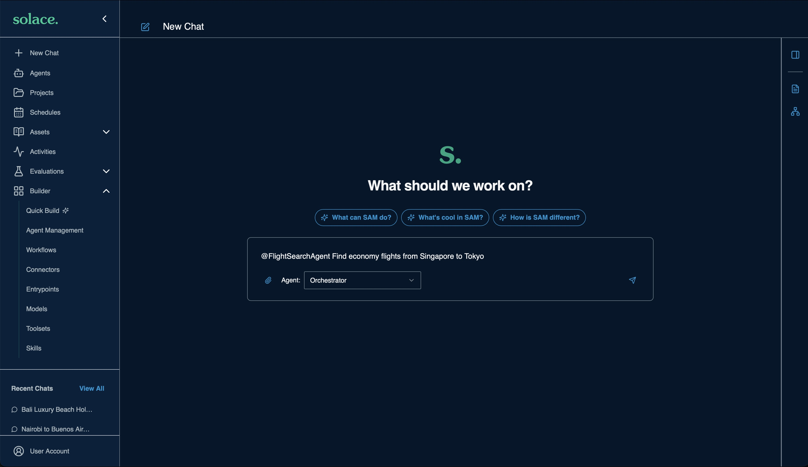
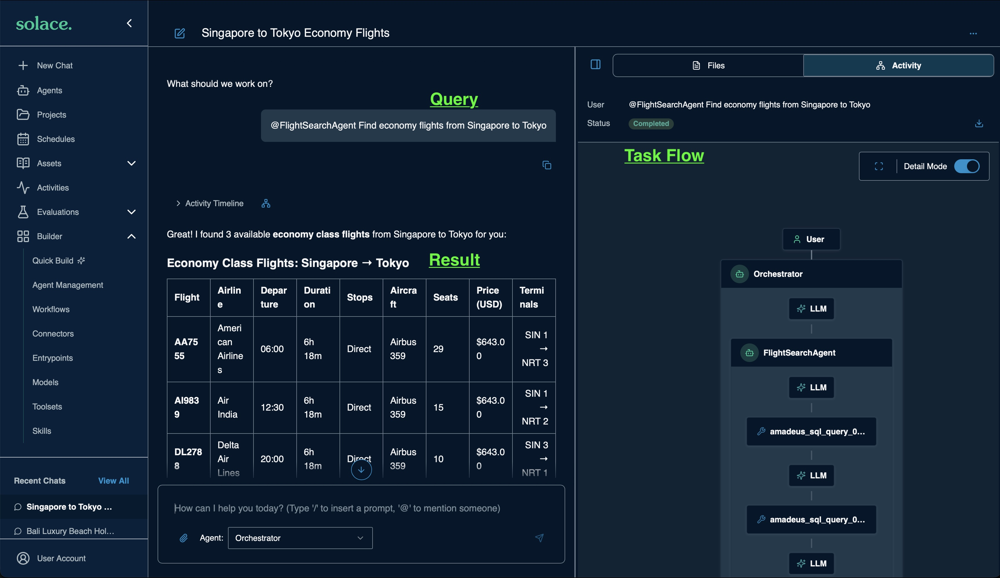
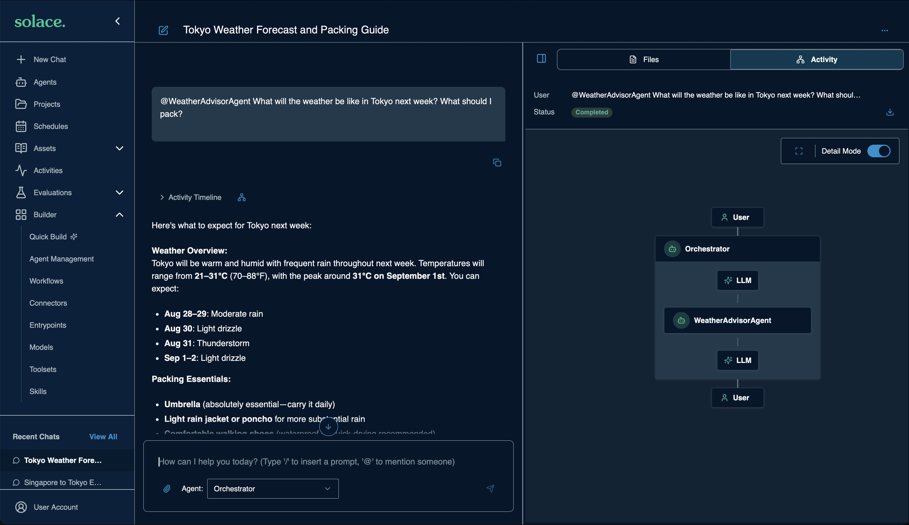

# [Hands-on] Run the System

Test each agent on its own, then run the full travel plan through the orchestrator.

---

## Step 1: Test individual agents

1. Click **+ New Chat**

    <div align="center">
      
    </div>

1. Send each prompt below, one at a time. Start a new chat for each agent.

**FlightSearchAgent**

```
@FlightSearchAgent Find economy flights from Singapore to Tokyo
```

<div align="center">
  
</div>

```
@FlightSearchAgent Find business class flights from Bangalore to San Francisco
```

**HotelSearchAgent**

```
@HotelSearchAgent Find 5-star hotels in Tokyo under $500 per night
```

```
@HotelSearchAgent Find beachfront resort hotels in Phuket with pool and spa
```

**LocalExperiencesAgent**

```
@LocalExperiencesAgent Find Japanese restaurants and cultural attractions in Tokyo
```

**WeatherAdvisorAgent**

```
@WeatherAdvisorAgent What will the weather be like in Tokyo next week? What should I pack?
```

<div align="center">
  
</div>

---

## Step 2: Run the full orchestration

Start a new chat for each prompt.

```
@TravelOrchestratorAgent Plan a 5-day trip from Singapore to Tokyo for 2 people.
Departure: 10 days from today. Return: 5 days later.
We enjoy Japanese cuisine, cultural sites, and outdoor activities.
Include flights, hotels, restaurants, weather forecast, and full budget breakdown.
```

```
@TravelOrchestratorAgent I want to travel from Nairobi to Buenos Aires next month.
2 adults, economy class, mid-range hotels. Best route and estimated total cost?
```

```
Plan a 7-night beach holiday in Bali for a couple.
Luxury resort with a beach villa, spa, and water sports.
Departure from London 10 days from today. Include weather and packing list.
```

> [!NOTE]
> The last prompt does not mention an agent. Observe how the default orchestrator decides which agents to involve, and compare the activity flow with the first two prompts.

### Expected agent flow

1. **TravelOrchestratorAgent** receives the request and delegates to the specialist agents
1. **FlightSearchAgent** → `flights-db` → `flight_offers` view → direct or connecting options
1. **HotelSearchAgent** → `hotels-db` → `hotel_offers` view → room options
1. **LocalExperiencesAgent** → `places-mcp` → Foursquare Places API
1. **WeatherAdvisorAgent** → A2A proxy → LangChain agent → Open-Meteo forecast
1. The orchestrator calls `compile_itinerary` → day-by-day plan
1. The orchestrator calls `calculate_budget` → cost breakdown

---
Section complete! Close this file and return to the Workshop Tracker to continue.
