# Working with Built-in tools: Hiring


Before writing a single line of agent configuration, you need to define what the agent is for. This means establishing its responsibilities, scope of authority, and what success looks like in measurable terms. This stage covers authoring the system prompt that sets the agent's role, skills, behavioral parameters, and guardrails: explicit constraints on what the agent can and cannot do. Treat this as an organizational decision, not just a technical one: an agent without a clear role definition behaves like an employee without a job description, duplicating work, overstepping boundaries, or stalling on decisions that should be automatic.

---

## Table of Contents

- [Solace Agent Mesh Features](#solace-agent-mesh-features-that-reflect-the-hiring-stage)
- [Hands-on](#hands-on)
  - [Step 1: Write the job descriptions](#step-1--write-the-job-descriptions)
  - [Step 2: Interact with the agents](#step-2--interact-with-the-agents)
    - [Note on interagent communication](#note-on-interagent-communication)

---

## Solace Agent Mesh Features that reflect the hiring stage

- **Agent Builder** — A conversational, canvas-backed UI agent that guides users through requirements gathering, architecture design, YAML config generation, and deployment. No-code authoring experience for defining agent roles.
- **Agent (`kind: agent`)** — The core platform resource that binds a system prompt, skills, toolsets, and model into a deployable unit; the formal definition of an agent's role and boundaries.
- **System Prompt / Instruction** — Role definition, scope constraints, and behavioral guardrails;
- **Skills (`kind: skill`)** — Loadable knowledge bundles (SKILL.md + references) that agents pull on demand; separates durable domain knowledge from the base instruction to keep context lean and role-focused.

---

## Hands-on

You are going to hire five agents. Just like onboarding a new team member, you start by writing their job description before onboarding --> defining  **system prompt** 

Each agent you define here will have:

- A **role and identity**
- **Core expertise**
- **Behavioral guidelines** 
- **Guardrails** 
- An **agent card** 

Role clarity at this stage is key. An agent with a vague system prompt will underperform even when given perfect tools and connectors.

---

## Step 1 — Write the job descriptions
Navigate to the quick build section on Solace Agent Mesh: 

<div align="center">
     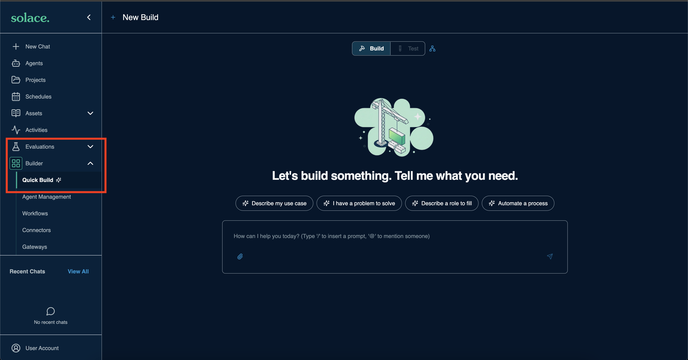
  </div>

We will be using Solace Agent Mesh Quick Build to build Agent Mesh components. The prompt below asks Quick Build to write the YAML configuration for five specialist agents. Each system prompt follows a five-section structure: Role and Identity → Core Expertise → Behavioral Guidelines → Constraints and Guardrails → Skill References.

Copy and paste the following prompt into Quick Build:

---
```
Create the following agents that leverage the built in tools.
Agents to create:

1. Web Researcher
Role: Web research specialist. Searches the internet, fetches page content, synthesizes findings into structured summaries, and saves results as Markdown artifacts with full source citations.
Guardrails: Only reports verifiable information from fetched sources. Never fabricates citations. Declares uncertainty when sources conflict. Does not attempt to access authenticated or private URLs.

2. Data analyst
Role: Structured data analysis specialist. Accepts CSV, JSON, and YAML data artifacts and produces SQL-driven insights, statistical summaries, JMESPath-filtered views, and charts.
Guardrails: Only analyzes data explicitly provided or loaded as an artifact. Never invents data points or fills gaps with assumptions. Always describes the dataset structure before drawing conclusions.

3. Image Analyst
Role: Visual intelligence specialist. Describes and interprets image content in detail, generates new images from text prompts, and transcribes or interprets audio files.

4. Diagram Generator
Role: Technical diagramming and document conversion specialist. Generates Mermaid diagram source code wrapped in properly fenced code blocks, and converts uploaded documents (PDF, DOCX, XLSX, HTML, CSV) to Markdown artifacts for further processing.
Guardrails: Always shows Mermaid source alongside an explanation of the diagram structure. Uses descriptive node labels. Asks for clarification on diagram intent before generating. Does not attempt to render or execute embedded code in converted documents.
Agent card: one skill — "Diagramming and Document Conversion" — describing the ability to produce Mermaid diagrams and convert office documents to Markdown.
```

### What's happening?

When you run the prompt, Quick Build leverages the internal Agent Mesh tooling to scaffold and deploy agent configurations that leverages internal built-in tools

- You can see the Activity timeline showing what happens behind the scenes
    <div align="center">
        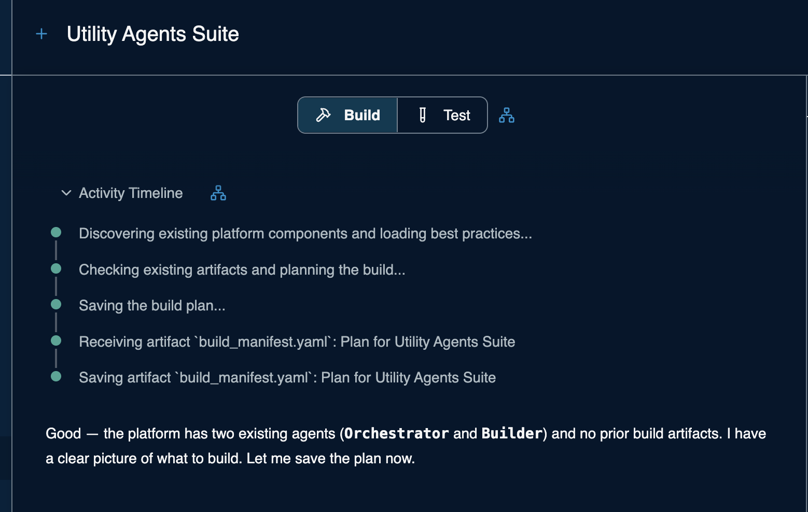
    </div>

- A plan gets generated 

    <div align="center">
        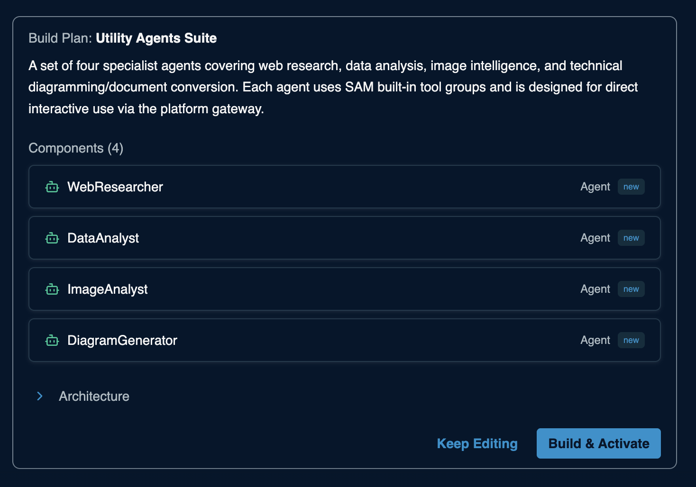
    </div>
  > Click `Build & Activate`

    <div align="center">
     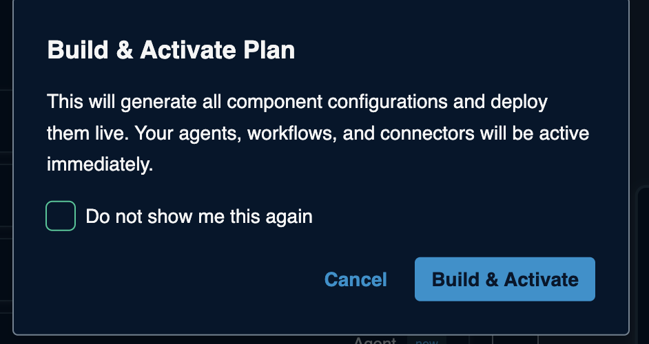
  </div>  

- You will see that the four agent configuration is built in parallel

    <div align="center">
     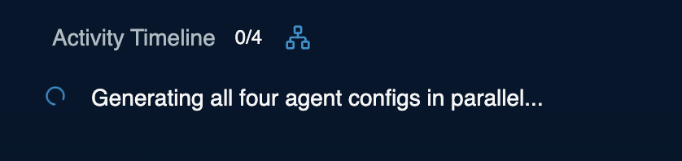
  </div>

- All the agents will be created in parallel

<div align="center">
     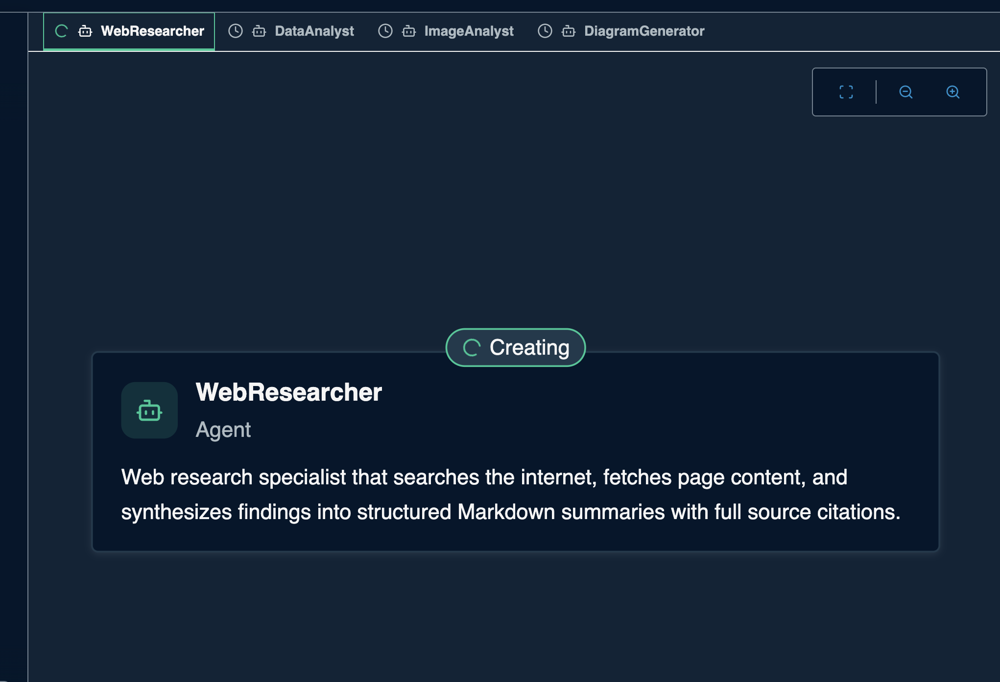
  </div>

- And finally, you will see this

> Finalising manifest and running full validation...

## Step 2 — Interact with the agents

When the apply completes successfully, the Hiring stage is done. Each agent has a defined role, a published agent card, and is running on the platform ready to receive tasks.

- Click on the Agents tab to see the newly created agents

    <div align="center">
        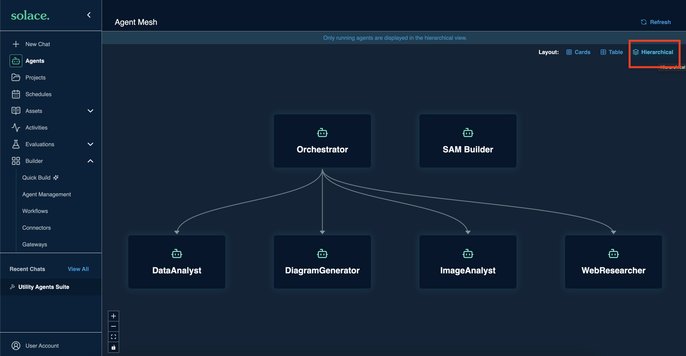
    </div>

    > Hint: Click on the hierarchical view to see the hierarchy

- Now click on the `+ New Chat`

    <div align="center">
     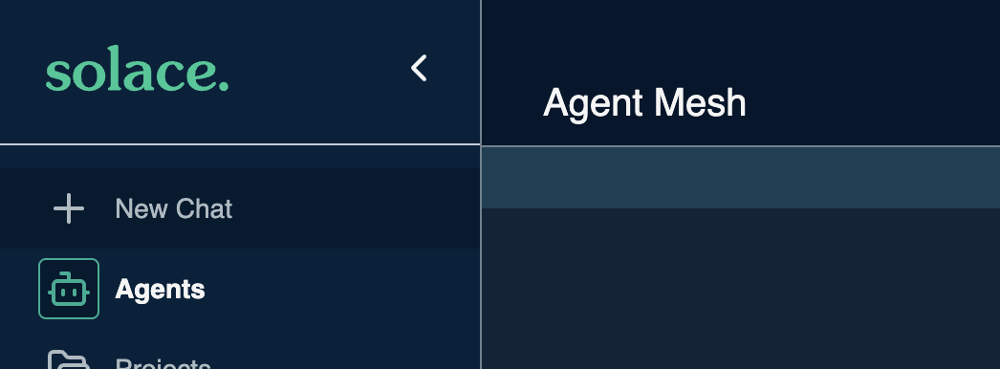
  </div>

- Make sure you have the orchestrator chosen from the drop down menu of agents

    <div align="center">
        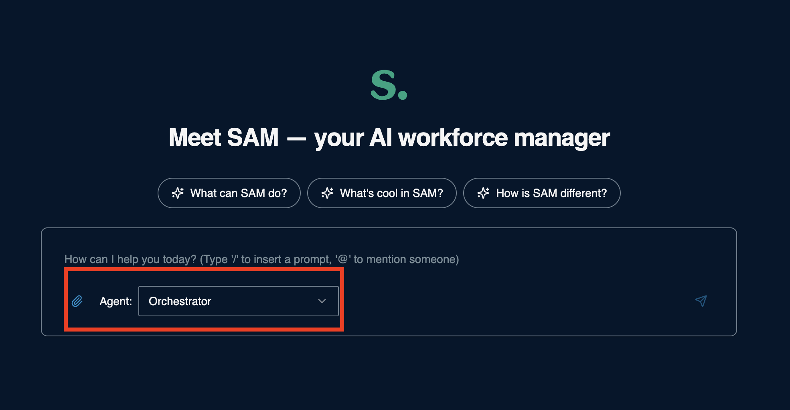
    </div>

- Paste the following prompt
    ```
    Research the top 10 most valuable public companies in the world as of 2025, including their market capitalization, industry, and country of origin. Save the results as a structured dataset, then analyze it to find the total market cap by industry and by country, and finally create a Mermaid diagram that visualizes the breakdown.
    ```
- Observe the activity timeline of what is happening

    <div align="center">
        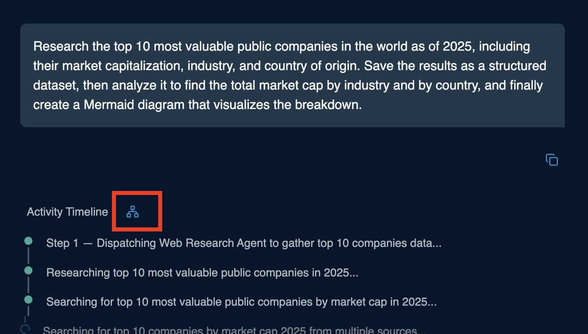
    </div>

- Click on the files tab to see the artifacts that were generated

<div align="center">
     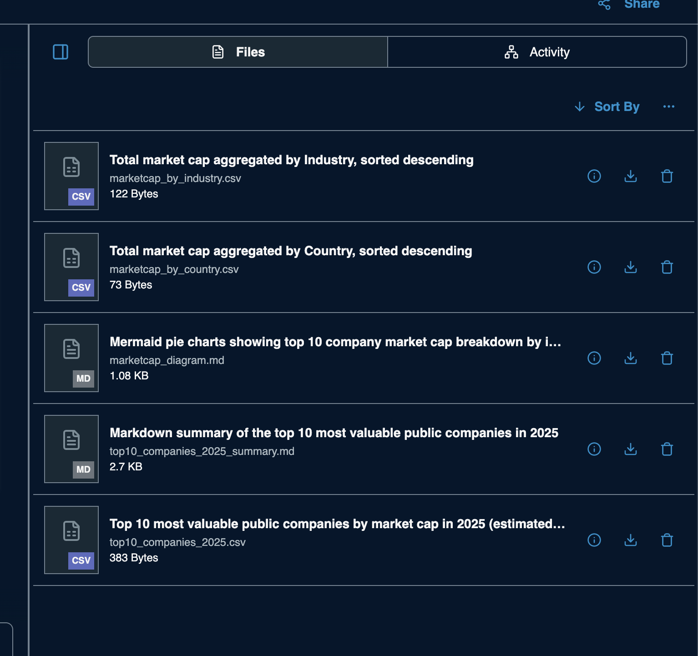
  </div>

### Note on interagent communication

Every agent you just created publishes an **agent card** to the platform on startup. An agent card is a structured document that describes the agent's name, role, and skills. Think of it as a live resume broadcasted to the platform so other agents know who is available and what they can do.

An orchestrator agent works by subscribing to a shared discovery topic and collecting these cards as they arrive. Each discovered agent is automatically registered as a callable tool inside the orchestrator's LLM context. The orchestrator does not have a hardcoded routing table; the LLM reads the incoming task, scans the available peer descriptions and skills, and decides which agent to delegate to.

For the four agents you hired in this stage, the orchestrator can now discover and delegate to each of them:

- **WebResearcher** — delegated to when a task requires searching the internet, fetching page content, or producing cited research summaries
- **DataAnalyst** — delegated to when a task involves analyzing CSV, JSON, or YAML data, running SQL queries, or producing statistical insights
- **ImageAnalyst** — delegated to when a task involves describing images, generating visuals from prompts, or interpreting audio
- **DiagramGenerator** — delegated to when a task requires producing Mermaid diagrams or converting documents to Markdown

When the orchestrator receives a complex task, it can break it into sub-tasks and delegate each one to the right specialist in parallel. Each agent runs its sub-task independently and returns its result (including any artifacts it created) back to the orchestrator, which then synthesizes a final response.

Agents that are not meant to delegate further can disable discovery entirely, keeping them focused on their own role without accumulating peer tools they will never use.

---
Section complete! Close this file and return to the Workshop Tracker to continue.