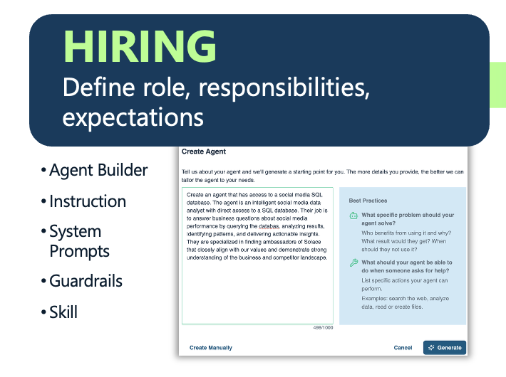

# Stage 1: Hiring: Define the Role

Before writing a single line of agent configuration, define what the agent is for. This means establishing its responsibilities, scope of authority, and what success looks like in measurable terms. This stage covers authoring the system prompt that sets the agent's role, skills, behavioral parameters, and guardrails: explicit constraints on what the agent can and cannot do. Treat this as an organizational decision, not just a technical one: an agent without a clear role definition behaves like an employee without a job description, duplicating work, overstepping boundaries, or stalling on decisions that should be automatic.

---

