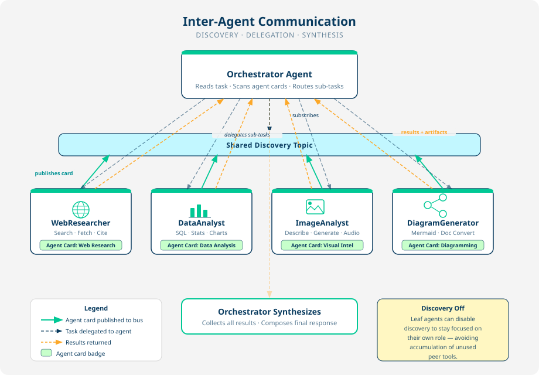

# The Agent That Owns the Problem

Connectors gave the mesh reach. Now something has to use it.

You are defining two agents. One owns a fulfillment exception from arrival to resolution. The other answers analytical questions about the inventory position. The interesting part of the first one is not what it can do, it is what it is forbidden from doing.

---

## Table of Contents

- [What an agent is made of](#what-an-agent-is-made-of)
- [Hands-on: the triage agent](#hands-on-the-triage-agent)
- [Hands-on: the analyst, and free delegation](#hands-on-the-analyst-and-free-delegation)
- [Guardrails are the interesting part](#guardrails-are-the-interesting-part)
- [What happened?](#what-happened)

---

## What an agent is made of

Four things, and the YAML is short enough to read in one sitting.

- **A system prompt.** Role, process, and constraints. This is where an agent's judgment comes from and where its limits are set.
- **An agent card** (`spec.skills`). Descriptors advertising what this agent can do, so the Orchestrator and other agents can discover it and route work to it. This is the "advertised capability" sense of the word, not a `kind: skill` resource.
- **References.** `connectors`, `toolsets`, and `skillRefs`, all by name. This is where the parts you build get attached.
- **Modes and deployment.** What it accepts, what it returns, whether it goes live on apply.

Watch the reference lists as you go. The agent file barely changes between here and section 500. It just accumulates names.

---

## Hands-on: the triage agent

1. Open [`sample_configuration/agents/order-triage.yaml`](../sample_configuration/agents/order-triage.yaml) and read the system prompt. Note the shape: a role, five numbered process steps, then a block of hard rules.

1. Look at the reference lists near the bottom:

    ```
      skillRefs:
        - meridian-customer-comms
      skillIds: []
      toolsets:
        - substitution-scoring
      connectors:
        - retail-postgres
        - product-catalog
    ```

    > Note: The connectors exist already. The toolset and the skill do not yet, which is why the manifest applies the agent last. You will build both in section 400.

1. For now, comment out the two references to things that do not exist yet, so the agent can be applied on its own:

    ```
      skillRefs: []
      skillIds: []
      toolsets: []
      connectors:
        - retail-postgres
        - product-catalog
    ```

1. Add the agent to the manifest:

    ```
      agents:
        - order-triage
    ```

1. Plan and apply:

    ```
    export RETAIL_DB_PASSWORD=postgres
    sam config plan --manifest sample_configuration/manifests/local.yaml
    sam config apply --manifest sample_configuration/manifests/local.yaml
    ```

1. Open a new chat, select `order-triage` from the agent menu, and ask it about the order this workshop follows:

    ```
    Order ORD-10428 cannot ship. Establish the facts: what was ordered, what is in stock, and who the customer is.
    ```

    <div align="center">
        
    </div>

1. Watch the activity timeline. The agent queried the database through the connector, and every number in its answer came from a row.

---

## Hands-on: the analyst, and free delegation

The second agent is read-only and analytical. It exists partly because the exception desk needs the wider picture, and partly to demonstrate something you get without configuring it.

1. Open [`sample_configuration/agents/inventory-analyst.yaml`](../sample_configuration/agents/inventory-analyst.yaml). It has one connector, no toolsets of its own beyond the built-ins, and an agent card advertising analysis rather than remediation.

    ```
      toolsets:
        - data_analysis
        - builtin_artifact_tools
      connectors:
        - retail-postgres
    ```

    > Note: `data_analysis` and `builtin_artifact_tools` are built-in toolsets. They ship with the platform, so they are referenced by ID and need no YAML of their own.

1. Add it to the manifest, plan, and apply:

    ```
      agents:
        - order-triage
        - inventory-analyst
    ```

    ```
    sam config plan --manifest sample_configuration/manifests/local.yaml
    sam config apply --manifest sample_configuration/manifests/local.yaml
    ```

1. Now start a chat with the **Orchestrator**, not with either agent directly, and ask:

    ```
    Which regions are shortest on jacket inventory right now, and chart it.
    ```

1. Watch the activity timeline.

    <div align="center">
        
    </div>

You did not tell the Orchestrator that `inventory-analyst` exists. You did not register it, route to it, or write any delegation logic. The agent published an agent card when it deployed, the Orchestrator discovered it, and it became available as a peer.

That is what the agent card is for. It is a live description of a capability, broadcast to the mesh, and discovery is the mesh's job rather than yours.

---

## Guardrails are the interesting part

Go back to `order-triage.yaml` and read the rules block again:

```
Rules you never break:
- Never invent a SKU, a price, a delivery date, or a stock number. Every figure
  you state must come from a tool result.
- Never rank or choose substitutes by your own judgment. If no scoring result
  is available and the tool cannot be called, say so and stop. Do not fall
  back to your own reasoning about which substitute is best.
- Never authorize a goodwill credit above $50. Escalate to a human instead.
- Never promise a restock date. You cannot know one.
- If the data is ambiguous, say so and escalate. A wrong remediation costs
  Meridian more than a slow one.
```

Every one of those is a rule about **money or trust**, and each maps to a way this agent could quietly cost Meridian more than the twelve people it replaces.

The second rule is the one to notice, because the next section exists to enforce it. A prompt rule is a request, not a constraint. A sufficiently confident model under pressure will help by guessing, and a guessed substitution ranking is indistinguishable from a real one until you check the margin at the end of the quarter.

That is why the ranking is leaving the prompt entirely.

---

And that's it! What happened?

You defined two agents and applied them:

1. **`order-triage`** owns a fulfillment exception end to end. It has both connectors, a system prompt with an explicit process, and a set of hard rules about what it must never do. Its `toolsets` and `skillRefs` lists are still empty, and the next section fills them.

2. **`inventory-analyst`** answers analytical questions over the same database, using built-in toolsets for SQL, transforms, and charts. It advertises analysis rather than remediation, so the Orchestrator routes the right questions to it.

The thing worth taking away is the delegation you did not configure. Peer discovery through agent cards means adding an agent to the mesh makes it available to every other agent, with no central registry to update and no routing table to maintain. You will use the same property in the final section, for a completely different purpose.

---
Section complete! Close this file and return to the Workshop Tracker to continue.
