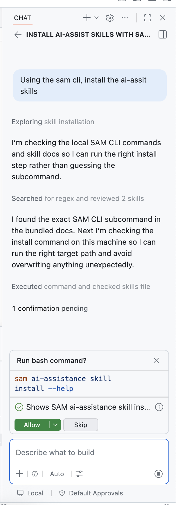

# Solace Agent Mesh CLI

The `sam` CLI is the primary developer interface for Solace Agent Mesh. It handles the full lifecycle of a SAM deployment: running components locally for development, managing authentication, packaging toolsets and skills, and driving configuration changes against a live platform. Rather than writing scripts that call APIs step by step, the CLI lets you describe *what you want* and handles the rest.

## Key Capabilities

**Local development** - `sam run` launches SAM components on your machine, spinning up a local broker and managing multi-process lifecycles so you can iterate quickly without a full cluster.

**Authentication management** - `sam auth` handles OAuth 2.0 login flows with token caching, so developers stay logged in across sessions while CI pipelines use environment variable tokens without any manifest changes.

**AI-assisted authoring** - `sam ai-assistance skill install` writes schema-aware skills into your AI coding assistant (Claude Code, GitHub Copilot, etc.), enabling it to generate valid SAM YAML without guessing field names.

**Toolset and skill packaging** - `sam toolset` and `sam skill` handle building, syncing, and uploading custom tool packages and knowledge bundles to a running platform.

**Declarative configuration** - `sam config` is the heart of production-grade deployments. It lets you describe your entire platform configuration as YAML files in a repository, then reconcile the running platform to match.

## Benefits

The CLI is designed to make SAM deployments reproducible, auditable, and safe. Config lives in plain YAML files that are reviewed as diffs before any change lands. Secrets never appear in files, only as `${VAR}` placeholders that resolve from environment variables at apply time. The same commands work against a local dev instance and a production cluster, just by pointing at a different target URL.

---

## Declarative SAM

Declarative SAM is the approach of describing the desired state of a SAM platform as a repository of plain YAML files, then using the CLI to reconcile the live platform to match that desired state.

Instead of writing scripts that call APIs ("create agent X, update gateway Y"), you write YAML that describes what the platform *should look like*. The CLI figures out the minimal set of creates, updates, and deletes needed to get there.


A declarative config repository follows a standard layout. Each resource kind has its own directory with one YAML file per resource:

```
repo-root/
├─ manifests/     # entry points (one per environment: dev.yaml, prod.yaml)
├─ agents/        # agent definitions
├─ gateways/      # HTTP, event mesh, Slack, email gateways
├─ models/        # LLM model configurations
├─ workflows/     # multi-step DAG processes
├─ toolsets/      # custom tool packages
├─ connectors/    # external service integrations
└─ skills/        # knowledge bundles
```

The **manifest** is the entry point for every config operation. It lists which resources to manage and where to apply them:

```yaml
kind: manifest
name: dev
target:
  url: http://localhost:8800
resources:
  models:
    - default-model
  agents:
    - my-agent
  gateways:
    - http-gateway
```

### AI-Assisted Authoring

Because SAM ships schema-accurate skills for AI coding assistants, you can author declarative config with natural language. Once skills are installed:

```bash
sam ai-assistance skill install
```

your AI assistant understands the full structure of every SAM resource kind and documentation, including valid field names, required fields, and common patterns. This makes writing and reviewing YAML significantly faster, especially when building out agents, gateways, or workflows for the first time.

---

## [Optional Hands-on] Using AI-Assist

Solace Agent Mesh CLI ships with AI-assist skills that can be used with your favourite AI coding tools (e.g. Claude Code, GitHub Copilot, Codex). In this workshop we will be using the integrated AI assistant to try out declarative SAM.

> Note: Github Codespace comes with integrated Github Copilot with limited free credits to try the ai assisted solace agent mesh skills

  <div align="center">
     
  </div>

Using the integrated AI assistant, run the following prompts:

```
Using the sam cli, install the ai-assist skills
```

```
Scaffold a folder structure for solace agent mesh in a folder called workshop_infra
```

```
Create a manifest file for local development with no auth and sam running on localhost:8800. Also create a .env file to hold any env vars
```

```
Pull the configuration. For any references to environment variables, populate the .env file. Use the LLM key located in .sam/settings.yaml
```
