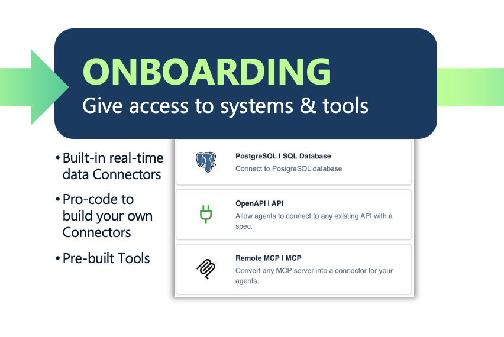
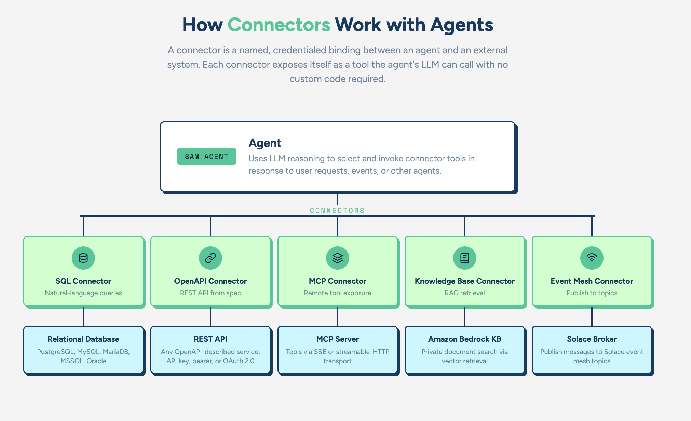
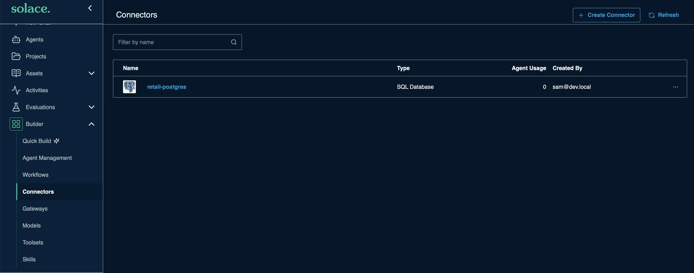
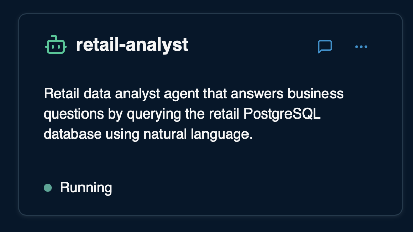

# Working with connectors to provision access: Onboarding 



Once the role is defined, connect the agent to the systems and data sources it needs to perform it. This is the direct analog to provisioning a new employee with tools, credentials, and access rights on day one. For AI agents, onboarding covers connectivity to enterprise databases via SQL, enterprise applications via APIs, MCP servers, and third-party agents via A2A protocols, as well as defining how the agent is triggered (chat, event, API call, or from another agent). Getting onboarding right means providing the right access: role-based access controls, SSO, and delegated identity ensure each agent operates only within the permissions appropriate to its defined function.

---

## Solace Agent Mesh Features used in the onboarding stage

- **SQL Connector** — Provides agents with query access to relational databases (PostgreSQL, MySQL, MariaDB).
- **MCP Connector** — Connects agents to any Model Context Protocol server via streamable-HTTP or SSE transport, exposing its tools natively to the agent.
- **API Connector (OpenAPI)** — Connects agents to any REST API described by an OpenAPI spec, with auto-detected authentication.
- **Knowledge Base Connector** — Wires agents to a managed vector knowledge base (Amazon Bedrock KB) for retrieval-augmented generation.
- **MCP Tools** — Tools exposed by external MCP servers (stdio, SSE, or streamable-HTTP) attached to an agent and discoverable at runtime.
- **Proxy (`kind: proxy`)** — Connects external A2A-over-HTTPS agents into the mesh; handles agent card fetching, auth (static bearer / API key / OAuth 2.0), and artifact format translation.

## Hands-on

Let's create a custom connector and an agent that uses this connector. 

### What are connectors? 

A connector is a named, credentialed binding between an agent and an external system. You define a connector once with the connection details and credentials for a system, then assign it to one or more agents by name. At runtime, the connector exposes itself to the agent as a tool: the agent's LLM can call it with natural-language-derived arguments, and the connector handles the actual network interaction. In every case, the pattern is the same: one connector definition, assigned to agents, with no custom code required. For example:

- **SQL connector** — lets an agent answer questions like "how many orders were placed last week" by generating and executing SQL against a PostgreSQL, MySQL, or MariaDB database.
- **OpenAPI connector** — parses a REST API spec and turns each operation into a callable tool, with support for API key, bearer token, and OAuth 2.0 authentication.
- **MCP connector** — fetches a remote MCP server's tool list and surfaces those tools natively to the agent via SSE or streamable-HTTP transport.
- **Knowledge Base connector** — retrieves relevant documents from an Amazon Bedrock knowledge base so the agent can answer questions grounded in your private data.

  <div align="center">
     
  </div>

### Declarative Applying

Navigate to the [local manifest file](../sample_configuration/manifests/local.yaml) in the sample_configuration and observe the configuration 

1. Change the local manifest file to include a connector by adding `- retail-postgres` under connectors

    ```
    kind: manifest
    name: local
    description: Local development environment (no auth)
    target:
        url: http://localhost:8800
    resources:
        models: []
        agents: []
        gateways: []
        workflows: []
        toolsets: []
        connectors:
            - retail-postgres
        skills: []
    ```
1. Open your integrated terminal in VsCode
1. Execute a plan for the configuration
    ```
    export RETAIL_DB_PASSWORD=postgres
    sam config plan --manifest sample_configuration/manifests/local.yaml
    ```

    > Note: Observe the following in the commandline
    ```
        connectors/
    + retail-postgres      create
    ```
1. Execute the following
    ```
    sam config apply --manifest sample_configuration/manifests/local.yaml
    ```
1. Observe the new database connector got added


  <div align="center">
     
  </div>

Now lets add the agent 

1. In your [local manifest file](sample_configuration/manifests/local.yaml), add the `- retail-analyst` in the list of agents. Your local manifest file should look like this
    ```
    kind: manifest
    name: local
    description: Local development environment (no auth)
    target:
        url: http://localhost:8800
    resources:
        models: []
        agents:
            - retail-analyst
        gateways: []
        workflows: []
        toolsets: []
        connectors:
            - retail-postgres
        skills: []

    ```
1. Apply the new configuration
    ```
    sam config apply --manifest sample_configuration/manifests/local.yaml
    ```
1. Observe the new agent created 

  <div align="center">
     
  </div>

1. Start a new chat and make sure to choose `retail_agent` agent from the down menu and test it out with the following prompts 
    ```
    Query one object from the db
    ```