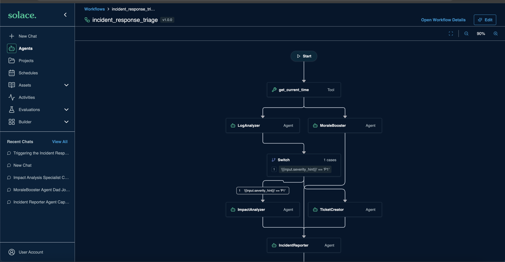

# Assembling the Parts

You have connectors, an agent, a toolset, and a skill. Handled one at a time in a chat window, they work.

Meridian has 3,000 exceptions in the queue and nobody to type into a chat window.

The steps are always the same: establish the facts, find candidates, score them, then either resolve or escalate. When you already know the order, you declare it rather than asking an agent to work it out each time.

---

## Table of Contents

- [When to declare instead of asking](#when-to-declare-instead-of-asking)
- [The shape of the workflow](#the-shape-of-the-workflow)
- [Hands-on: wire in the scoring step](#hands-on-wire-in-the-scoring-step)
- [Hands-on: run it](#hands-on-run-it)
- [What happened?](#what-happened)

---

## When to declare instead of asking

An agent decides what to do next by reasoning about it, every single time. That is exactly what you want when the next step genuinely depends on what just came back, and exactly what you do not want when it does not.

Declare a workflow when:

- **The sequence is known ahead of time.** You are not discovering it at runtime.
- **You want validation between steps.** Each node's output can be checked before the next one consumes it, which stops an error cascading.
- **You want per-step retry.** If step three fails, retry step three. With one agent improvising, failure usually means starting over.
- **You want auditability.** Every node's input and output is recorded separately, which matters when the thing being audited moved money.

Meridian's exception process is all four. The order never changes.

Workflows contain agents. The workflow controls *what happens in what order*; the agents handle *how* within each step.

---

## The shape of the workflow

<div align="center">
     
</div>

Six nodes. Every part you built appears exactly once.

| Node | Type | What it uses |
|---|---|---|
| `establish_facts` | agent | `order-triage` → `retail-postgres` |
| `find_candidates` | agent | `order-triage` → `product-catalog` |
| `score_candidates` | **tool** | `substitution-scoring` directly |
| `credit_gate` | switch | workflow logic |
| `draft_resolution` | agent | `order-triage` → `meridian-customer-comms` |
| `escalate` | agent | `order-triage` |

The third node is the one to look at. It is a `tool` node, not an agent node, which means the scoring runs with **no model in the loop at all**. The workflow calls the Go binary directly and hands the result to the next step. Section 400 argued that ranking substitutes should not involve a model; this is where that argument becomes structural rather than a request in a prompt.

The fourth node is a switch. Under $50 the agent resolves it, over $50 a human decides. The ceiling lives in the skill, and the workflow enforces it.

---

## Hands-on: wire in the scoring step

The workflow ships with the scoring node stubbed. You are going to connect it.

1. Open [`sample_configuration/workflows/order-exception-remediation.yaml`](../sample_configuration/workflows/order-exception-remediation.yaml) and read it top to bottom. It is long but there is nothing hidden in it.

1. Find the `score_candidates` node. It names the tool but its inputs are empty:

    ```
      - id: score_candidates
        type: tool
        depends_on: [establish_facts, find_candidates]
        tool_name: substitution-scoring__score_substitutes
        input:
    ```

    > Note: A custom toolset's tools are addressed as `<toolset>__<tool>`. The toolset is `substitution-scoring` and the tool inside it is `score_substitutes`.

1. Fill in the inputs. Each one pulls from an upstream node's output:

    ```
        input:
          original:       "{{establish_facts.output.original}}"
          qty:            "{{establish_facts.output.qty}}"
          ship_to_state:  "{{establish_facts.output.ship_to_state}}"
          ship_to_region: "{{establish_facts.output.ship_to_region}}"
          rules:          "{{find_candidates.output.rules}}"
          candidates:     "{{find_candidates.output.candidates}}"
    ```

    > Note: `depends_on` already lists both upstream nodes. If you reference a node's output you must also declare the dependency, or the workflow may run the node before its input exists.

1. Add the workflow to the manifest:

    ```
      workflows:
        - order-exception-remediation
    ```

1. Plan and apply:

    ```
    export RETAIL_DB_PASSWORD=postgres
    sam config plan --manifest sample_configuration/manifests/local.yaml
    sam config apply --manifest sample_configuration/manifests/local.yaml
    ```

---

## Hands-on: run it

1. In the Solace Agent Mesh client, open the **Workflows** tab and select `order-exception-remediation`.

1. Run it with the canonical order:

    ```
    { "order_id": "ORD-10428" }
    ```

1. Watch the node graph as it executes. Each node lights up in turn, and you can click any one of them to see exactly what went in and what came out.

    <div align="center">
        
    </div>

1. Open `score_candidates` and look at its output. The full ranking, every component score, and the rejected candidates with their reasons. No model touched any of those numbers.

1. Open `draft_resolution` and read the message. Brand voice from the skill, figures from the tool, and nothing invented.

You have now run the whole of Meridian's exception process end to end, from a single order id.

> Note: The workflow ran because you clicked a button. Nobody at Meridian is going to click a button 3,000 times. That is the next section.

---

And that's it! What happened?

You declared a six-node workflow and ran it against the order this workshop has been following:

1. **Two agent nodes** established the facts and gathered candidates, each reaching a different system through a different connector.

2. **One tool node** scored the candidates with no model involved. The workflow calls the Go binary directly, which is why the ranking is identical every time you run it.

3. **A switch node** enforced the $50 credit ceiling, routing to a human when the case exceeds what an agent may authorize.

4. **Two terminal nodes** either drafted the customer message using the skill, or packaged the case for a human reviewer.

Every component from sections 200 through 400 appears exactly once, and nothing you built earlier went unused. That is worth checking in your own designs: if a part does not appear in the assembly, it should not be in the system.

The thing to take away is where the intelligence sits. The workflow is not smart. It does not reason about what to do next, and that is the point. Reasoning lives in the agent nodes, arithmetic lives in the tool node, and the sequence is declared by a person who already knew it. Each piece is doing the thing it is actually good at.

---
Section complete! Close this file and return to the Workshop Tracker to continue.
