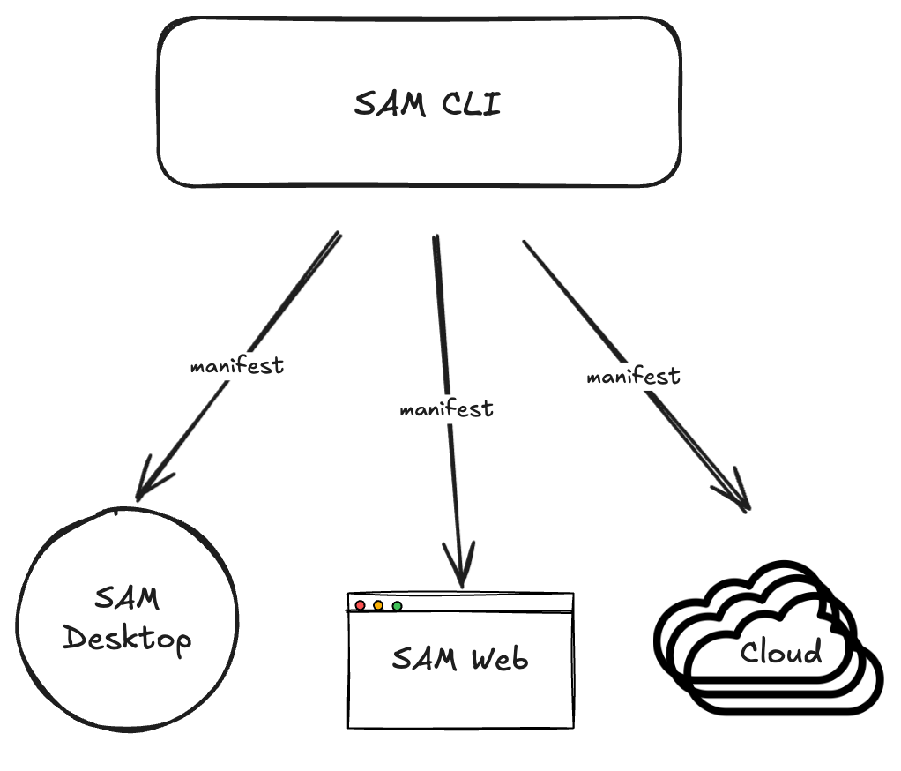

# Appendix: Going Deeper on the CLI

**This is reference material, not a lab.** You used `sam config plan` and `sam config apply` six times during the workshop. This appendix covers the rest of the CLI, for when you take this back to your own environment.

---

## Table of Contents

- [What the CLI is for](#what-the-cli-is-for)
- [Declarative configuration](#declarative-configuration)
- [Repository layout](#repository-layout)
- [Secrets](#secrets)
- [Promoting between environments](#promoting-between-environments)
- [Toolsets and skills](#toolsets-and-skills)
- [AI-assisted authoring](#ai-assisted-authoring)
- [Command reference](#command-reference)

---

## What the CLI is for

`sam` is the primary developer interface. It runs components locally, manages authentication, packages toolsets and skills, and drives configuration against a live platform.

The design goal is that deployments are reproducible, auditable, and safe. Configuration is plain YAML reviewed as a diff before anything lands. Secrets are never in files. The same commands work against a laptop and a production cluster, and the only difference is the target URL.

<div align="center">
  
</div>

---

## Declarative configuration

Instead of scripting API calls ("create agent X, then update entrypoint Y"), you describe what the platform *should look like* and let the CLI work out the minimal set of creates, updates, and deletes.

That is what you were doing all workshop. Three commands carry almost all of it:

```
sam config plan   --manifest <path>    # show what would change
sam config apply  --manifest <path>    # make it so
sam config pull   --manifest <path>    # write the live platform back to YAML
```

`plan` is the one worth building a habit around. It is read-only, it shows the exact diff, and running it before every apply is how you avoid discovering a destructive change after the fact.

`pull` is the direction people forget exists. If someone built an agent in the web UI and you want it in version control, pull writes it out as YAML that re-applies with no diff.

---

## Repository layout

A declarative config repository has one directory per resource kind, and one file per resource:

```
repo-root/
├─ manifests/      entry points, one per environment
├─ agents/
├─ connectors/
├─ entrypoints/
├─ models/
├─ workflows/
├─ toolsets/       yaml plus a per-toolset source directory
├─ skills/         one directory per skill, each with a SKILL.md
├─ datasets/       yaml plus a csv sidecar
├─ evaluators/
└─ experiments/
```

Two kinds do not follow the one-file rule, and both caught people out during the workshop:

- **Skills are directory-shaped.** `skills/<name>/SKILL.md` is the resource. There is no `skills/<name>.yaml`, and the frontmatter `name` must match the directory name and the manifest entry or the plan hard-errors.
- **Toolsets are a pair.** `toolsets/<name>.yaml` holds the metadata, `toolsets/<name>/src/` holds the code. A toolset with a prebuilt `<name>.zip` instead of `src/` is uploaded as-is; having both is an error.

The manifest is the entry point for every operation. It names the target and lists what to manage:

```yaml
kind: manifest
name: prod
target:
  url: ${PLATFORM_URL}
  auth:
    type: bearer_token
    envVar: PLATFORM_TOKEN
resources:
  agents:
    - order-triage
  connectors:
    - retail-postgres
```

---

## Secrets

Secrets never go in files. They are `${VAR}` placeholders resolved from the environment at apply time:

```yaml
password: ${RETAIL_DB_PASSWORD}
api_key: ${OPENAI_API_KEY}
api_base: ${OPENAI_API_BASE, https://api.openai.com/v1}
```

The second form supplies a default. The first requires the variable to be set.

Two rules worth internalising:

- **Put secrets at the toolset level, not per agent.** One API key serves every agent using the toolset. The per-agent config block is for non-secret tunables that legitimately differ.
- **Values the platform returns redacted are excluded from the plan diff**, so re-planning an unchanged repository does not show a spurious update every time.

---

## Promoting between environments

This is the payoff of the whole model. The same resource files, a different manifest:

```
sam config apply --manifest manifests/dev.yaml
sam config apply --manifest manifests/staging.yaml
sam config apply --manifest manifests/prod.yaml
```

Each manifest names a different `target.url` and a different set of environment variables for secrets. The agents, connectors, and workflows are byte-identical, which means what you tested in staging is what runs in production.

Manifests can also import shared resources from a git source, so several teams can consume a common set of connectors without copying them.

---

## Toolsets and skills

Scaffolding, building, and syncing:

```
sam toolset init <name> --lang go        # scaffold, with the SDK vendored offline
sam toolset init <name> --lang python
sam toolset sync                         # re-vendor the Go SDK after a CLI upgrade
sam toolset validate <name>              # host build plus the schema probe the runtime runs
sam skill init <name> --with-tool        # a skill bundle with a tool inside it
```

For Go tools the SDK is embedded in the CLI binary and written into `src/_sdk/samtoolsdk/` at scaffold time, with a `replace` directive in `go.mod` pointing at it. That is why the workshop toolset builds with no network access. Leave the `replace` line alone.

`sam config plan` and `apply` build toolset sources automatically and cache the result per target platform, so a warm plan is a no-op. `--no-build` skips it for CI pipelines that build separately.

---

## AI-assisted authoring

```
sam ai-assistance skill install
```

This writes schema-aware reference documentation into your AI coding assistant, so it generates valid YAML instead of guessing field names. It is what the twelve `sam-*` directories under `.claude/skills/` in this repository are, and they were regenerated from the CLI version bundled here.

Re-run it with `--force` after upgrading the CLI. The schemas are generated from the live types, so a stale copy will confidently produce YAML for fields that no longer exist.

> Note: These are Claude Code authoring aids and have nothing to do with `kind: skill` resources on the platform. The name collision is unfortunate and worth being precise about in your own documentation.

---

## Command reference

The commands you will actually use, roughly in the order you meet them:

| Command | What it does |
|---|---|
| `sam run <configs>` | Run the platform locally |
| `sam auth login --manifest <path>` | Browser OAuth flow, cached per target |
| `sam config plan --manifest <path>` | Show the diff. Read-only |
| `sam config apply --manifest <path>` | Reconcile the platform to the manifest |
| `sam config pull --manifest <path>` | Write the live platform back to YAML |
| `sam config schema <kind>` | Print the live field schema for a resource kind |
| `sam toolset init <name> --lang go` | Scaffold a toolset |
| `sam toolset validate <name>` | Build and probe a toolset locally |
| `sam skill init <name>` | Scaffold a skill bundle |
| `sam ai-assistance skill install` | Install schema docs into your AI assistant |
| `sam config cache prune` | Clear stale toolset build caches |

`sam config schema <kind>` is the one to remember. It prints the authoritative field list for any resource kind straight from the binary, which beats guessing from an example every time.

---
Section complete! Close this file and return to the Workshop Tracker to continue.
