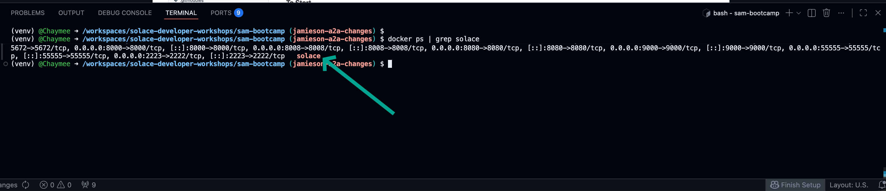
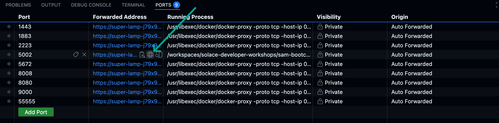
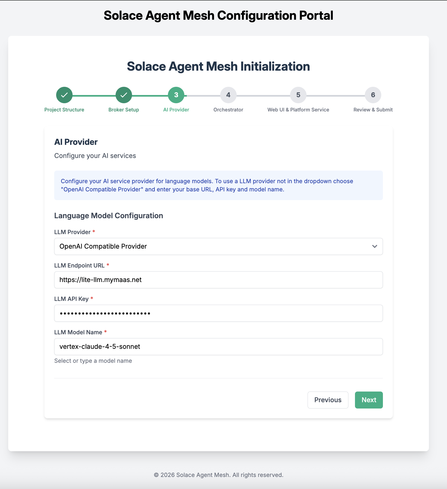
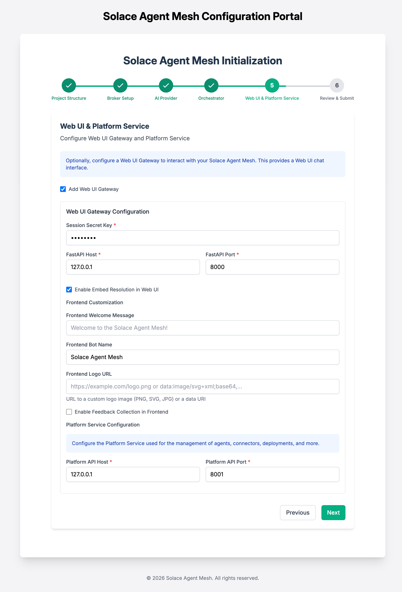
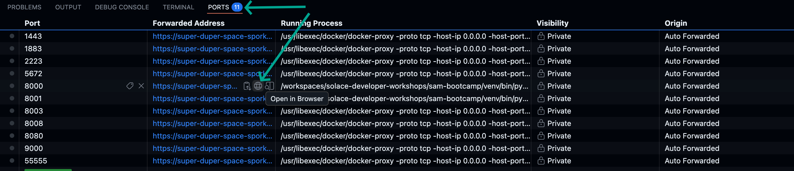
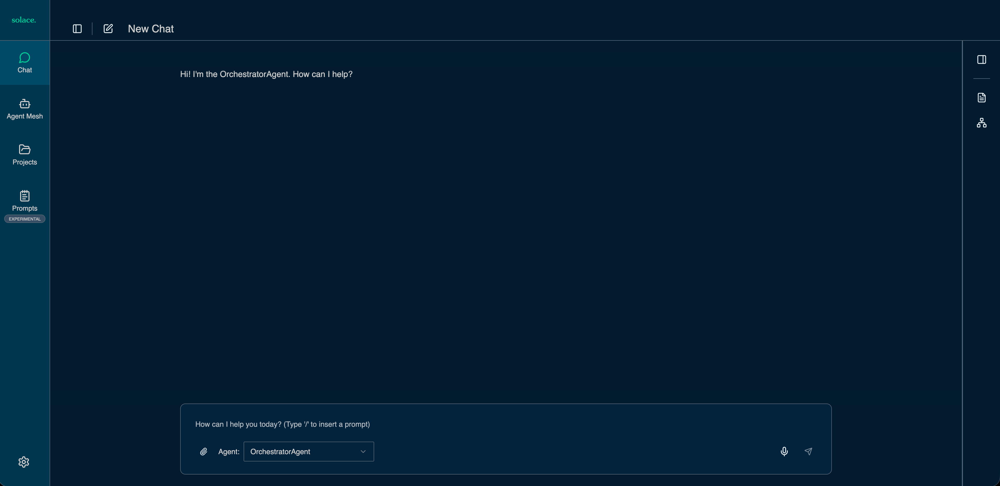

# Solace Agent Mesh Setup

⭐️ Take a moment to check out the open source repo and give it a star! [https://github.com/SolaceLabs/solace-agent-mesh](https://github.com/SolaceLabs/solace-agent-mesh)

---
> **Prerequisites:**
> You'll need a GitHub account to participate in this workshop.
> Don't have one yet? Follow these quick steps:
> - Visit [GitHub](https://github.com/)
> - Click **Sign up** or **Continue with Google**
> - Follow the prompts to complete setup

## Table of Contents
- [1. Setup GitHub Codespace](#1-setup-github-codespace-skip-if-already-in-codespace)
- [2. Install Solace Agent Mesh](#2-install-solace-agent-mesh)
- [3. Initialize Solace Agent Mesh](#3-initialize-solace-agent-mesh)
- [4. Start Solace Agent Mesh](#4-start-solace-agent-mesh)

---

## 1. Setup GitHub Codespace [Skip if already in Codespace]

### Step 1: **Open the Workshop Repository**
   Visit [Solace Developer Workshops](https://github.com/SolaceDev/solace-developer-workshops/)
   

### Step 2: Click **Open in GitHub Codespaces**
   

### Step 3: Choose **Change Options** → set machine type to **4-core**
   

### Step 4: Click **Create Codespace**
   Once it's ready, you'll see Visual Studio Code running in your browser — your personal VM workspace.
   

---

## 2. Install Solace Agent Mesh

### Step 1: Install Solace Agent Mesh CLI
In the terminal, run the following commands.
```
mkdir sam-bootcamp
cd sam-bootcamp
```

### Step 2: Setup Python virtual environment
```
python3.12 -m venv venv
```

### Step 3: Activate virtual environment
```
source venv/bin/activate
```

### Step 4: Install solace agent mesh and Astral UV
```
pip install solace-agent-mesh==1.13.0 uv
```

### Step 5: Verify installation
```
uvx -v
sam -v
```
You should see the installed sam version information.

### Step 6: Verify Solace Broker is up and running
``` sh
docker ps | grep solace
```
Look for container, image and port information for the Solace broker (auto started during dev container startup)


---

## 3. Initialize Solace Agent Mesh

### Step 1: Initialize Solace Agent Mesh
In the `/workspaces/solace-developer-workshops/sam-bootcamp` directory, run the following


```
sam init --gui
```

This opens a browser portal — click **Open in Browser** (or use Cmd/Ctrl + Click on the link in the log, e.g., `http://127.0.0.1:8000`).


If you miss the prompt you can always access the port forwarded UI in the `PORTS` tab and select the globe icon on the `5002` port line. 


In the opened web page, configure Solace Agent Mesh.

1. From here, choose "Advanced Setup" to spin up an instance of the Agent Mesh that uses the Solace Broker as the communication backbone.

> Note that the simple setup "Getting Started Quickly" spins up Agent Mesh without the Solace Broker and uses in-memory queues instead. This is not meant for production ready development and proof of concept project that require high performance and multiple Agentic workflow interactions.


2. Choose a namespace for your project
> The namespace will act as the topic root for all events in Solace Agent Mesh


3. Configure connection to the Solace Broker
You will need the connection credentials from for the broker deployment method selected for your workshop. 

>A Local Broker will start automatically with codespace deployment
Credentials you will need later for Solace Agent Mesh Setup
>- Username: default
>- Password: default
>- VPN Name: default
>- Host: ws://localhost:8008

- You can use the default values in the **Broker Setup** screen
  
  
  
4. Configure your LLM endpoint, API Key, and Model name
> The model of choice impacts the performance of your results and system behavior. A performant model is recommended for advanced use-cases

- Choose **OpenAI Compatible Provider**
- Set **LLM Endpoint URL** to `https://lite-llm.mymaas.net`
- Enter the **LLM API Key** shared during the workshop
- Select **vertex-claude-4-5-sonnet** from the model dropdown

  

5. Configure the orchestrator agent
> Keep all the configuration parameters as default. You can explore the other options for configuring the orchestrator agent to see what you have available for fine tuning the behavior


6. Configure the WebUI Gateway
> Note: Choose any Session Secret Key needed for the WebUI. Keep the remaining configurations as default.




7. After initialization completes, you'll see confirmation in your Codespaces terminal:


The sam-bootcamp folder will have the basic structure created, and you are all set to go.


---

## 4. Start Solace Agent Mesh
   ```bash
   sam run
   ```

You'll see logs as the system starts:


> ⚠️ **Note:** When prompted to open a port (8080), wait until logs stabilize, then open the browser view or use the URL `http://127.0.0.1:8000`.

Your Solace Agent Mesh Chat interface will now appear:


> ⚠️ **Note:** If you cannot find the equivilent of  `http://127.0.0.1:8000` in your CodeSpace you can get to it by clicking on the `PORTS` tab next to your terminal tab. Then select the globe icon on the row with port 8000. This will open the Solace Agent Mesh in your browser. 




---
[Next Section: Adding Built-in Agents](./100-adding-builtin-agents.md)