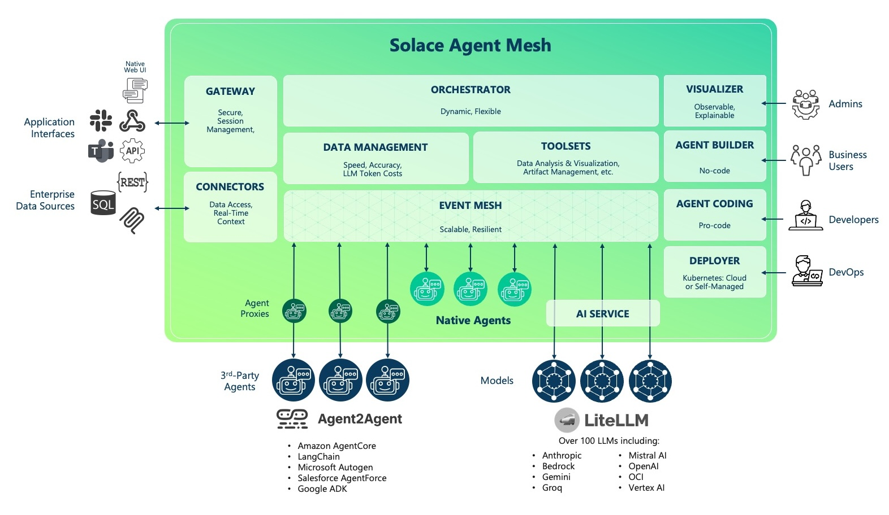

# What is Solace Agent Mesh

[Solace Agent Mesh](https://github.com/SolaceLabs/solace-agent-mesh) is an open-source, event-driven framework that creates a distributed ecosystem of collaborative AI agents.

## Table of Contents
- [Key Architectural Principles](#key-architectural-principles)
- [Challenges with Agentic Systems](#challenges-with-agentic-systems)
- [Why Event-Driven Real-Time Architecture Matters](#why-event-driven-real-time-architecture-matters)

---

At its core, Solace Agent Mesh addresses a fundamental challenge in AI development: connecting powerful AI models to the data and systems where they provide value across an enterprise. Modern AI models are extremely capable, but the data that drives meaningful outcomes often lives in isolated silos:
- Databases
- APIs
- SaaS platforms
- Legacy applications
- Events streams
- and disparate systems.

Bridging this gap requires more than standalone AI services; it requires an architecture that integrates, orchestrates, and enables real-time collaboration among many specialized AI agents.

Agent Mesh is an event-driven, distributed, and decoupled agentic AI framework built on Solace’s proven event mesh and integrated with the Google Agent Development Kit (ADK). Rather than building monolithic AI applications, Agent Mesh allows you to create specialized agents that each excel at specific tasks and collaborate through standardized communication. These agents could be hosted on whatever runtime environment such as AgentCore, be in any region, use any LLM model such as those that are hosted on Bedrock, and leverage A2A protocol

## Key Architectural Principles

- **Event-Driven Architecture (EDA)**: All interactions between components (Agents, Gateways, and Systems) are asynchronous and mediated by the Solace event broker, eliminating direct dependencies, enabling parallelism, and ensuring guaranteed delivery even during component restarts or failure. The Solace Broker is an advanced message broker built on Event Mesh and Pub/Sub fundamentals.

- **Component Decoupling**: Agents, gateways, and services communicate through standardized messages without needing to know each other's implementation details. This decoupling lets teams build, deploy, scale, and upgrade independently

- **Scalability and Resilience**: The architecture supports horizontal scaling with fault tolerance and guaranteed message delivery

- **Standardized A2A Protocol**: Agents use A2A protocol to discover peers, delegate tasks, return results, and update status —-> all via hierarchical topic structures

    

## Challenges with Agentic Systems

Building truly agentic AI systems, especially in enterprise contexts, introduces several non-trivial challenges:

- **Data Silos & Integration Complexity**: AI models are powerful, but their value comes from contextual data spread across disparate systems that must be integrated seamlessly.

- **Real-Time Collaboration**: Agents need to communicate, delegate, and synchronize state in real time. This requires asynchronous communication patterns and message brokering, not simple synchronous HTTP calls.

- **Scalability & Parallelism**: Systems must handle many agents concurrently without bottlenecking, requiring distributed messaging, dynamic orchestration, and horizontal scaling.

- **Fault Tolerance & Resilience**: In distributed, autonomous systems, components will fail — resilient retry mechanisms, guaranteed delivery, and decoupled communication are essential.

- **Observability & Debugging**: Multiple agents operating asynchronously demand traceability — from request to final response — across distributed logs, events, and workflows.

- **Governance & Security**: Fine-grained access control, authentication, and controlled entry points matter, especially when agents access sensitive enterprise data.

- **Context Management**: Agents must maintain and share evolving context across task boundaries and conversation state without inconsistent or stale views.

## Why Event-Driven Real-Time Architecture Matters

Traditional AI integration approaches (synchronous REST calls, batch processing, or tightly coupled pipelines) fall short when agents must observe, react to, and collaborate on live signals from enterprises. The following is enabled with adopting an event-driven architecture for your Agentic AI System

- **Agents need current context**: True agency requires reacting to *what’s happening now*, not stale cached data. Event streams deliver up-to-the-moment facts as they occur.

- **Parallelism and asynchrony**: Agents often work on different parts of a task simultaneously. Event flows support independent concurrency without blocking or locking resources.

- **Fault tolerance**: Real systems are flaky. EDA decouples senders from receivers so work isn’t lost when components restart or fail.

- **Observability and traceability**: Events carry correlation context and status paths that make debugging and tracing workflows more reliable.

- **Integration with live enterprise sources**: Agents can subscribe to real business events from apps, databases, IoT streams, or APIs, turning raw events into intent streams that guide workflows.

To learn more about EDA in Agentic Systems, read more about:

- [Agentic AI In Enterprise Environments](https://solace.com/products/agent-mesh/)
- [What is Agentic AI](https://solace.com/what-is-agentic-ai/)

Now lets get back to the hands-on!
---
[Next Section: Adding Built-in Agents](./100-adding-builtin-agents.md)
