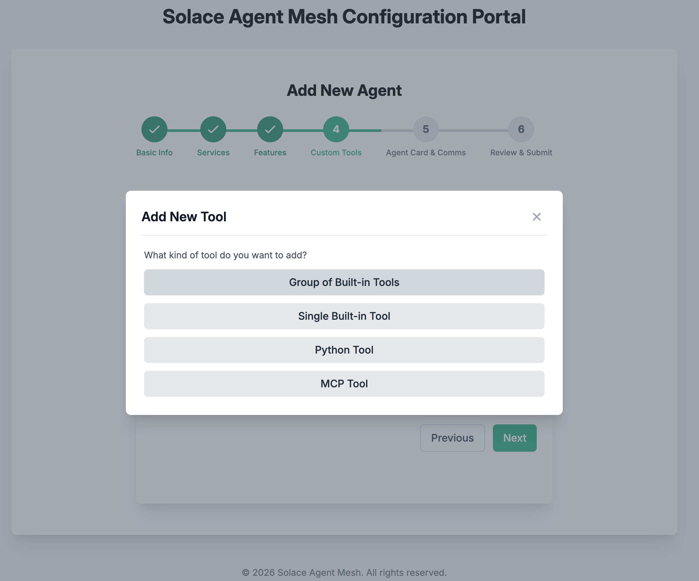

# Adding Built-in Agents to Solace Agent Mesh

## Table of Contents
- [1. Explore Agents](#1-explore-agents)
- [2. Install Built-in Tools (Agents)](#2-install-built-in-tools-agents)

---

## 1. Explore Agents

Now, let's interact with Solace Agent Mesh.

Enter in the chat area:
```
What agents do you have access to and what are their capabilities?
```

> Note: For the rest of the workshop, you can pull up all the saved prompts by typing forward slash `/` in the chat bar and prefixing the prompt with the step number e.g. `100-`

You can visualize agent interactions (e.g., **Orchestrator ↔ LLM**) by clicking the **network** icon below any chat response.

> 💬 As you install more agents, you can always ask Solace Agent Mesh for a list of available agents and capabilities.

<div align="center">
    
</div>

---

## 2. Install Built-in Tools (Agents)

There are 2 ways to run Solace Agent Mesh Agents:
1. `sam run` This will start all of the Solace Agent Mesh agents that are present in the `configs/agents/` directory. During this workshop you will likely have to kill the existing process with `Ctrl+C` and enter `sam run`, to pickup your new changes as we add and modify agents.
2. Launch the agents independently. This is useful in production scenarios, the Orchestrator and each agent will be run as a seperate task which can be brought online and offiline independently.  To use this approach you must have Solace Agent Mesh already running with `sam run` then open a new terminal and pass the agent configuration YAML files as arguments to a new `sam run` command.
The process would be as follows:
> - Open a new terminal
> - Activate the environment 
``` bash
      cd sam-bootcamp
      source venv/bin/activate
```
> - Launch the agents

  ```sam run config/agents/name_of_agent.yaml```

**In this workshop we will be using the first approach in this workshop.  We will kill the existing sam instance with `Ctrl+C` and start it again as we add new agents.**

Solace Agent Mesh comes with a set of built-in tools. Built-in tools are pre-packaged functionalities that can be granted to agents without requiring custom Python code. These tools address common operations such as file management, data analysis, web requests, and multi-modal generation.

### Adding agents with the GUI
1. **Access the Add Agent GUI**

  Kill your existing `sam run` execution with `ctrl + c` in your terminal
  then issue:

   ```bash
   sam add agent --gui
   ```
> **NOTE**: The opened page might show the Solace Agent Mesh installation GUI to the end of the URL.

```bash

/?config_mode=addAgent
```
For example: The opened page URL `https://glorious-bassoon-j79qgqjxgrh996-5002.app.github.dev/`, change it to `https://glorious-bassoon-j79qgqjxgrh996-5002.app.github.dev/?config_mode=addAgent`

**Name the agent as `Builtin Tools` and click on `Next`**

<div align="center">
    
</div>

**Use the default setting and click on `Next`**

<div align="center">
    
</div>

**Use the default setting and click on `Next`**

<div align="center">
    
</div>

**Click on `+ Add Tool` button**

<div align="center">
    
</div>

<div align="center">
    
</div>

<div align="center">
    
</div>

**Select the following tools and add**
  + Data Analysis
  + General
  + Internal
  + Web

**Click on `Next`**

<div align="center">
    
</div>

**Update the Agent Card Description and click on `Next`**

```
A helpful AI Assistant. You have access to internal tools such as data analytics, web, and other general tools
```

<div align="center">
    
</div>

**Review the agent summary configuration and click on `Save Agent & Finish`**

<div align="center">
    
</div>

2. **Start Solace Agent Mesh with the new Agents**
Close your brower tab. 
Back in the codelab Terminal issue `sam run`
Return to the Solace Agent Mesh UI at port 8000 forwarded from your codespace.
Review the Agents. In the Solace Agent Mesh browser tab, click on `Agents` to see the newly added agent.

<div align="center">
    
</div>

3. **Let us test the use of these agents. In the Chat, enter a simple query**

```bash
What agents do you have access to and what are their capabilities?
```

<div align="center">
    
</div>

> **HINT:** If the workflow panel is not visible, just click on the network image !at the bottom of the chat panel (left)


<div align="center">
    
</div>

4. **Let us issue a query that makes use of the built-in tools.**

```bash
Summarize the capabilities of the agent with sample queries as a HTML report
```
You will see an HTML report listing agentic capabilities available.

<div align="center">
    
</div>

---

[Next Section: Adding pre build agents](./200-adding-prebuilt-agents.md)