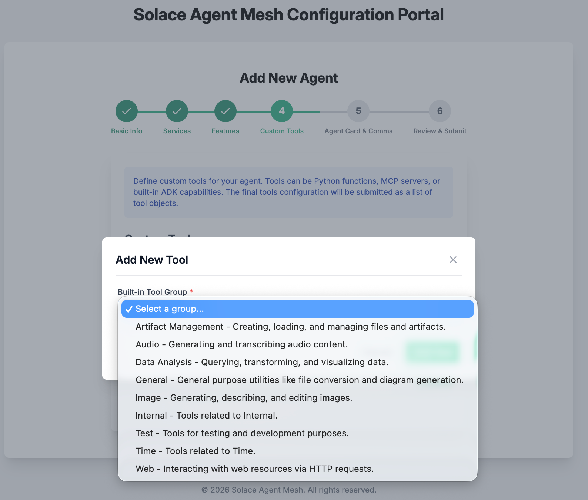
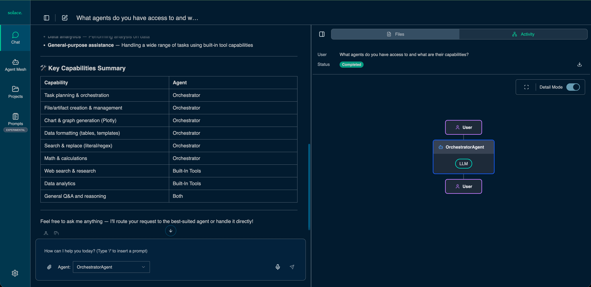
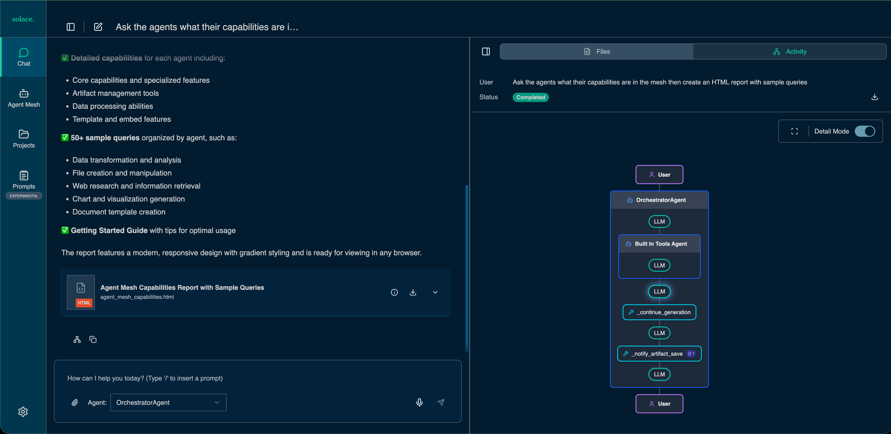

# Adding agents with the GUI
Follow this guide to learn how to add agents using the SAM gui

1. **Access the Add Agent GUI**

  Kill your existing `sam run` execution with `ctrl + c` in your terminal
  then issue:

   ```bash
   sam add agent --gui
   ```
> **NOTE**: The opened page might show the Solace Agent Mesh installation GUI to the end of the URL.

```bash

/?config_mode=addAgent
```
For example: The opened page URL `https://glorious-bassoon-j79qgqjxgrh996-5002.app.github.dev/`, change it to `https://glorious-bassoon-j79qgqjxgrh996-5002.app.github.dev/?config_mode=addAgent`

**Name the agent as `Builtin Tools` and click on `Next`**

<div align="center">
    
</div>

**Use the default setting and click on `Next`**

<div align="center">
    
</div>

**Use the default setting and click on `Next`**

<div align="center">
    
</div>

**Click on `+ Add Tool` button**

<div align="center">
    
</div>

<div align="center">
    
</div>

<div align="center">
    
</div>

**Select the following tools and add**
  + Data Analysis
  + General
  + Internal
  + Web

**Click on `Next`**

<div align="center">
    
</div>

**Update the Agent Card Description and click on `Next`**

```
A helpful AI Assistant. You have access to internal tools such as data analytics, web, and other general tools
```

<div align="center">
    
</div>

**Review the agent summary configuration and click on `Save Agent & Finish`**.

<div align="center">
    
</div>

2. **Start Solace Agent Mesh with the new Agents**

    - Close your brower tab. 
    - Back in the codespace Terminal, kill the add agent instance by running `Ctrl + C`
    - Issue `sam run`
    - Return to the Solace Agent Mesh UI at port 8000 forwarded from your codespace.
    - Review the Agents. In the Solace Agent Mesh browser tab, click on `Agents` to see the newly added agent.

<div align="center">
    
</div>

3. **Let us test the use of these agents. In the Chat, enter a simple query**

```bash
What agents do you have access to and what are their capabilities?
```

<div align="center">
    
</div>

> **HINT:** If the workflow panel is not visible, just click on the network image !at the bottom of the chat panel (left)


<div align="center">
    
</div>

4. **Let us issue a query that makes use of the built-in tools.**

```bash
Summarize the capabilities of the agent with sample queries as a HTML report
```
You will see an HTML report listing agentic capabilities available.

<div align="center">
    
</div>

---

[Next Section: Adding pre build agents](./200-adding-prebuilt-agents.md)