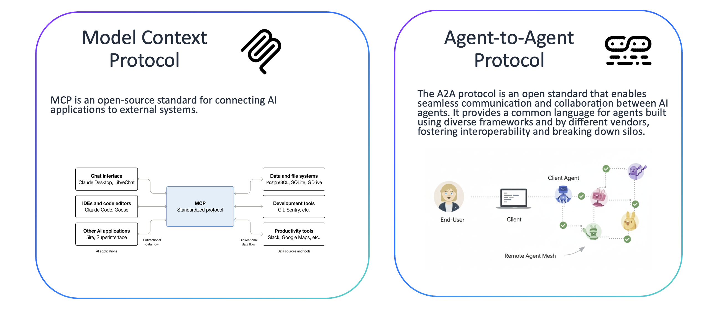
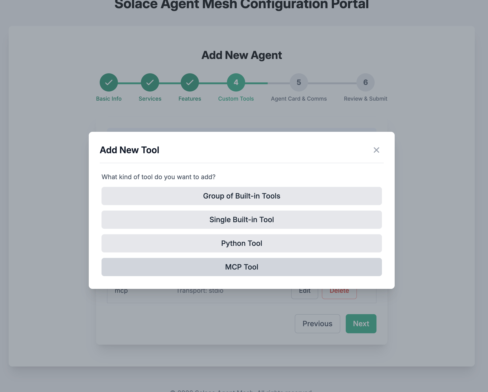
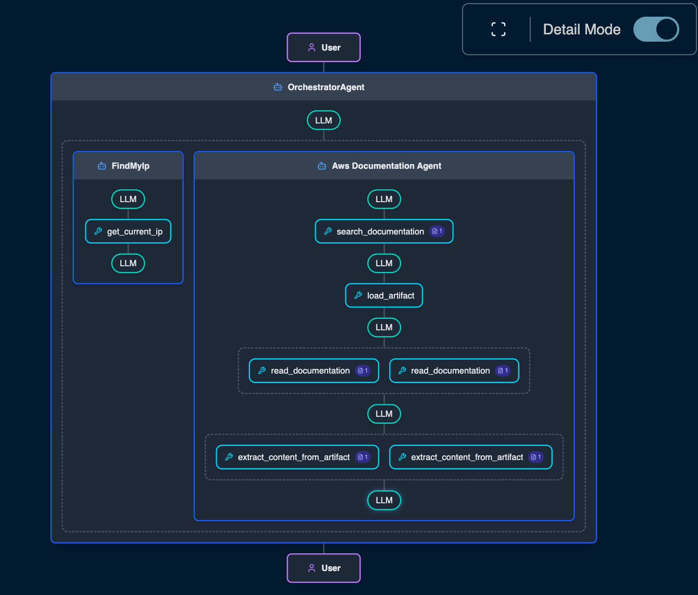

# MCP Server Agents

## Table of Contents
- [Adding the AWS Documentation MCP Server Agent](#adding-the-aws-documentation-mcp-server-agent)
  - [Option 1: Using the Solace Agent Mesh GUI](#option-1-using-the-solace-agent-mesh-gui)
  - [Option 2: Using the CLI](#option-2-using-the-cli)

---
## What is an MCP Server?
The Model Context Protocol (MCP) is an open standard designed to connect Large Language Models (LLMs) to external data sources and tools. An MCP Server acts as a standardized interface or "connector" that exposes specific capabilities such as database access, local file manipulation, or API integrations to an LLM. By providing a uniform way for models to discover and execute tools, MCP eliminates the need to write custom integration code for every new data source.

<div align="center">
    
</div>

## Why add MCP Servers to Solace Agent Mesh
MCP Servers are no longer the newest technology on the block for allowing agent to agent communication but they serve a valuable role in providing a means for existing applications to be utilized by LLMs.  By adding MCP Servers to our Solace Agent Mesh we can take advanatage of a vast catalog of tools that are exposed in a way that is easy for LLMs to consume and act on without having to re-write or re-wrap those tools in A2A frameworks.  

### Adding the AWS Documentation MCP Server Agent

This section describes how to add the [AWS Documentation MCP server](https://awslabs.github.io/mcp/servers/aws-documentation-mcp-server) to your Solace Agent Mesh deployment, both via the GUI and using the CLI.

**For the sake of time we will use the yaml configuration and replace it with the pre-configured file.  [Option 2: Using the CLI](#option-2-using-the-cli)**

---

#### Option 1: Using the Solace Agent Mesh GUI
1. In a new terminal, navigate to your Solace Agent Mesh workspace:

   ```bash
   cd sam-bootcamp
   source venv/bin/activate
   ```
2. Create a proxy configuration:
   ```bash
   sam add agent --gui
   ```
   You might have to append `/?config_mode=addAgent` to the end of the url in your browser to reach the new agent page. 
   It should look similar to `https://super-duper-space-spork-5r5w5ww44rh7gvp-5002.app.github.dev/?config_mode=addAgent`
3. Populate Agent Name and Instructions
**Agent Name**
`awsDocumentation`
**Model Type**
`General Model (*general_model)`
**Instructions**
  `
  You are an AI documentation assistant named __AGENT_NAME__. Your goal is to use the AWS documentation MCP server to explore and respond to requests about AWS product usage in an accurate and concise way. `

<div align="center">
    
</div>

4. **Use Default artifact service**
5. **Use Reference artifact handling**

<div align="center">
    
</div>

6. **We have to add our MCP Server invocation options, the tools will be pulled from the MCP Server by the agent.**
Press 'Add Tool'

<div align="center">
    
</div>

Supply A tool name and Connection Parameters
```json
{
"type": "stdio",
"command": "uvx",
"args": ["awslabs.aws-documentation-mcp-server@latest"]
}
```
Supply Environment Variables then press the green 'Add Tool' button then 'Next'.
```json
{
  "FASTMCP_LOG_LEVEL": "ERROR",
  "AWS_DOCUMENTATION_PARTITION": "aws",
  "MCP_USER_AGENT": "Mozilla/5.0 (Windows NT 10.0; Win64; x64) AppleWebKit/537.36 (KHTML, like Gecko) Chrome/131.0.0.0 Safari/537.36"
}
```

<div align="center">
    
</div>

7. **Populate Agent Card and Discovery options. We will use the same Agent Card description as agent description above**
```
You are an AI documentation assistant named awsDocumentation. Your goal is to use the AWS documentation MCP server to explore and respond to requests about AWS product usage in an accurate and concise way.
```

<div align="center">
    
</div>

8. **Review the Agent configuration then Save Agent & Finish**

<div align="center">
    
</div>

**[Continue by starting Solace Agent Mesh](#run-solace-agent-mesh-with-the-new-aws-documentation-agent)**
You can also copy the premade [aws_documentation_agent.yaml](../artifacts/400-aws_documentation_agent.yaml) into your config if you have issues or follow the configuration guide below. 

For more details, refer to the [Solace Agent Mesh MCP integration guide](https://solacelabs.github.io/solace-agent-mesh/docs/documentation/developing/tutorials/mcp-integration).

---

#### Option 2: Using the CLI

You can also add the agent via the CLI and manually configure the YAML.
Stop any existing execution by issuing `ctrl + c` in your terminal. 

1. Run the following command to generate the agent configuration:

  ```sh
  solace-agent-mesh add agent aws-documentation --skip
  ```

2. This will create a new agent YAML file: [aws-documentation_agent.yaml](../../sam-bootcamp/configs/agents/aws_documentation_agent.yaml). Copy the modified aws-documentation_agent yaml configuration into the new file that was created. From terminal, run the following

  ```
  cp ../solace-agent-mesh/artifacts/400-aws_documentation_agent.yaml configs/agents/aws_documentation_agent.yaml
  ```

Look at these sections of the [aws-documentation_agent.yaml](../../sam-bootcamp/configs/agents/aws_documentation_agent.yaml) to see what we updated. 
  
  - The `instructions` on line 25 got updated to 
    ```
    You are an AI documentation assistant named awsDocumentation. Your goal is to use the AWS documentation MCP server to explore and respond to requests about AWS product usage in an accurate and concise way. 
    ```
    This is the system instructions propagated to the LLM calls
  - The `tools` section now has an MCP tool that is configured with a `stdio` connection param type
    ```yaml
    tools: 
        - group_name: artifact_management
          tool_type: builtin-group
        - connection_params:
            args:
            - awslabs.aws-documentation-mcp-server@latest
            command: uvx
            timeout: 30
            type: stdio
          environment_variables:
            AWS_DOCUMENTATION_PARTITION: aws
            FASTMCP_LOG_LEVEL: ERROR
            MCP_USER_AGENT: Mozilla/5.0 (Windows NT 10.0; Win64; x64) AppleWebKit/537.36 (KHTML,
              like Gecko) Chrome/131.0.0.0 Safari/537.36
          tool_type: mcp
      ```

      > Note: To configure other types of MCP server (e.g. Remote MCP), check out the [MCP Integration](https://solacelabs.github.io/solace-agent-mesh/docs/documentation/developing/tutorials/mcp-integration) section in the documentation

4. Save the file and apply the configuration:

## Run Solace Agent Mesh with the new AWS Documentation Agent

  ```sh
  sam run
  ```
  We can string together multiple agents with a prompt such as 
  ```
  How can I access a server running on port 9000 in an ec2 instance from my IP address? Also list the factors of my IP address if it was a decimal number not an IP address.
  ```

<div align="center">
    
</div>

---
### 🎯 Challenge

Before the workshop ends:
1. Come up with some prompts that leverage 2 or more of the agents that we added today to accomplish a cohesive task.  Share your prompts in the chat.  
2. Connect at least **2 A2A agents** to your Solace Agent Mesh instance. Share in the chat what agents you are adding to your Solace Agent Mesh. 
3. Leverage any new A2A agents that you added together on a single objective.  Share in the chat your favorite agent interaction from the day. 

> 🔧 **Need help?** Ask in [Solace Community](https://community.solace.com/c/solace-agent-mesh/16) or during the workshop Q&A.

---

### ✅ That's It!
You’ve successfully:  
- Set up GitHub Codespaces  
- Installed and initialized Solace Agent Mesh  
- Started your own Solace Agent Mesh instance
- Explored and installed agents  
- Brought your own A2A agents from multiple agent platforms together on Solace Agent Mesh
- Brought your MCP Servers to Solace Agent Mesh

> 🧠 Next step: Try deploying additional A2A agents onto Solace Agent Mesh so that you can call agents across multiple agentic platforms to accomplish your goals.


---

For more information, see the 
[AWS Documentation MCP server documentation](https://awslabs.github.io/mcp/servers/aws-documentation-mcp-server) and the 
[Solace Agent Mesh MCP integration tutorial](https://solacelabs.github.io/solace-agent-mesh/docs/documentation/developing/tutorials/mcp-integration) and 
[Astral UV](https://docs.astral.sh/uv/)


---
Next: [Resources Section](./999-resources.md)
