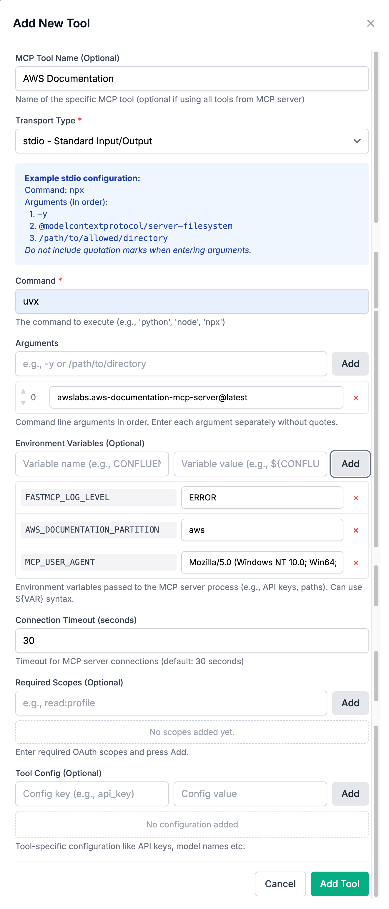
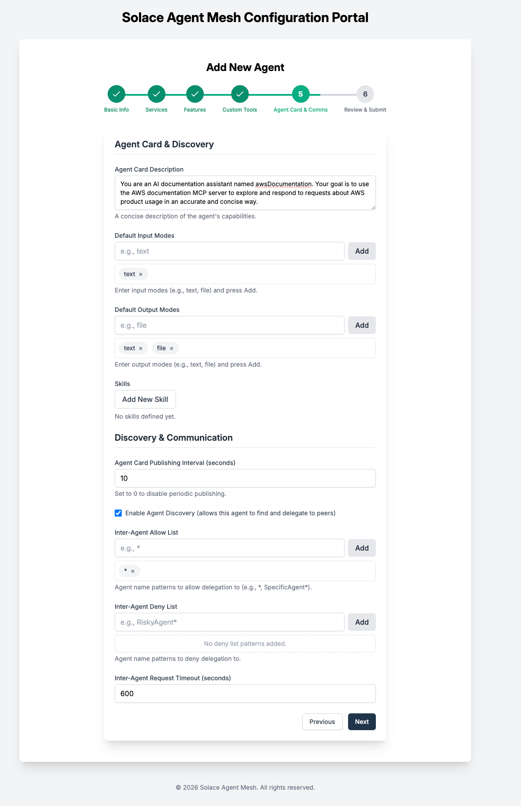
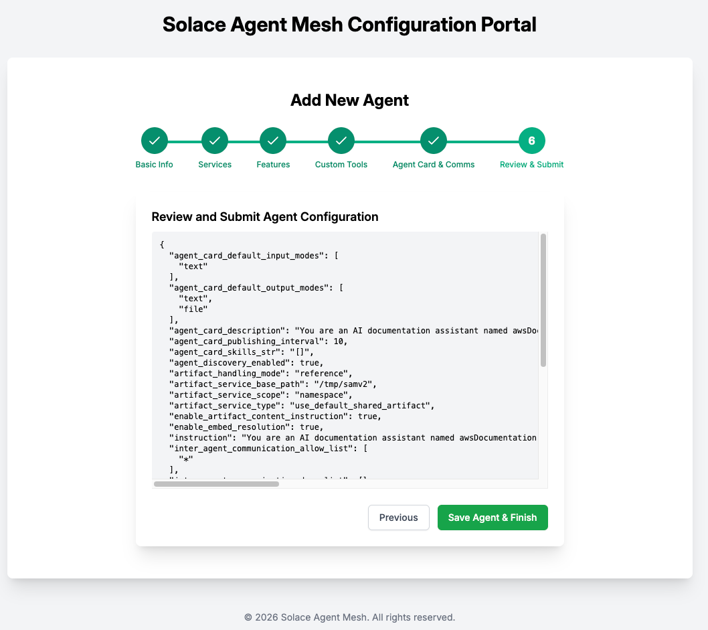

# 400 MCP Server Agents

### Adding the AWS Documentation MCP Server Agent

This section describes how to add the [AWS Documentation MCP server](https://awslabs.github.io/mcp/servers/aws-documentation-mcp-server) to your Solace Agent Mesh deployment, both via the GUI and using the CLI.

---

#### Option 1: Using the Solace Agent Mesh GUI

1. Open the terminal to your Solace Agent Mesh install location
2. Ensure your virtual environment is activated
``` source .venv/bin/activate``` 
3. Create a new agent 
  ``` solace-agent-mesh add agent --gui``` 
4. Populate Agent Name and Instructions
  ``` 
  You are an AI documentation assistant named __AGENT_NAME__. Your goal is to use the AWS documentation MCP server to explore and respond to requests about AWS product usage in an accurate and concise way. 

  ```


5. Use Default artifact service
6. Use Reference artifact handling


7. We have to add our MCP Server invocation options, the tools will be pulled from the MCP Server by the agent. 
Connection Parameters
```
{
"type": "stdio",
"command": "uvx",
"args": ["awslabs.aws-documentation-mcp-server@latest"]
}
```
Environment Variables
```
{"FASTMCP_LOG_LEVEL": "ERROR",
"AWS_DOCUMENTATION_PARTITION": "aws",
"MCP_USER_AGENT": "Mozilla/5.0 (Windows NT 10.0; Win64; x64) AppleWebKit/537.36 (KHTML, like Gecko) Chrome/131.0.0.0 Safari/537.36"}
```



8. Populate Agent Card and Discovery options. We will use the same Agent Card description as agent description above


9. Review the Agent configuration then **Save Agent & Finish**


For more details, refer to the [Solace Agent Mesh MCP integration guide](https://solacelabs.github.io/solace-agent-mesh/docs/documentation/developing/tutorials/mcp-integration).

---

#### Option 2: Using the CLI

You can also add the agent via the CLI and manually configure the YAML.

1. Run the following command to generate the agent configuration:

  ```sh
  solace-agent-mesh add agent aws-documentation --skip
  ```

2. This will create a new agent YAML file (e.g., `agents/aws-documentation.yaml`). Open this file and configure it as follows:

  ```yaml
  # Solace Agent Mesh Agent Configuration

log:
  stdout_log_level: INFO
  log_file_level: DEBUG
  log_file: a2a_agent.log

!include ../shared_config.yaml

apps:
  - name: "AwsDocumentation__app"
    app_base_path: .
    app_module: solace_agent_mesh.agent.sac.app
    broker:
      <<: *broker_connection

    app_config:
      namespace: "${NAMESPACE}"
      supports_streaming: false
      agent_name: "AwsDocumentation"
      display_name: "Aws Documentation Agent"
      model: *general_model 
    # Add any additional configuration see 400-aws_documentation_agent.yaml
  ```

3. Add you MCP Server as a tool to the agent config
``` yaml
tools: 
        - group_name: artifact_management
          tool_type: builtin-group
        - tool_type: mcp
          connection_params:
            args:
            - awslabs.aws-documentation-mcp-server@latest
            command: uvx
            timeout: 30
            type: stdio
          environment_variables:
            AWS_DOCUMENTATION_PARTITION: aws
            FASTMCP_LOG_LEVEL: ERROR
            MCP_USER_AGENT: Mozilla/5.0 (Windows NT 10.0; Win64; x64) AppleWebKit/537.36 (KHTML,
              like Gecko) Chrome/131.0.0.0 Safari/537.36
          
```
4. Save the file and apply the configuration:
You will find a completed [MCP server yaml here](../artifacts/400-aws_documentation_agent.yaml) for reference or to copy if you run into issues
You can run a single agent at a time or a list of agents by supplying their path after the run argument

  ```sh
  solace-agent-mesh run configs/agents/aws_documentation_agent.yaml
  ```

---

For more information, see the [AWS Documentation MCP server documentation](https://awslabs.github.io/mcp/servers/aws-documentation-mcp-server) and the [Solace Agent Mesh MCP integration tutorial](https://solacelabs.github.io/solace-agent-mesh/docs/documentation/developing/tutorials/mcp-integration).

---
### [Next Section: 500-bring-your-own-agents.md](./500-bring-your-own-agents.md)